# SWT/RCP → Vaadin: What Actually Happened

> **A living document.** This is written as the experiment progresses, not reconstructed
> afterwards. It will contain dead ends, wrong turns, and things that didn't work — on
> purpose. See [`../README.md`](../README.md) for the experiment brief and ground rules.
>
> _Status: target chosen; original binary diagnosed as dead; runnable "before" obtained (incl. a
> native-arm64 from-source build); the slice's RCP/JFace code mapped and the migration designed
> (plan mode); and a **runnable Vaadin 25.1 POC built and verified** in the browser
> (`poc/headlines/`, screenshots in `docs/after/`). End of **day 1**: the POC now reproduces
> RSSOwl's **three-pane layout** (feeds tree → headlines → reader) over **live RSS from RSSOwl's
> default feeds** — 15 category folders + ungrouped channels + 5 saved-search smart folders, with
> grouping, sorting, a context menu, and Signals-driven detail. Honest findings recorded below._

---

## The question

> **Can an SWT master-detail screen — a tree of feeds, a sortable headlines table with a
> context menu, and an article reader — be moved to a Vaadin Grid + detail view, and where
> does it break?**

Framed from the developer's side, not Vaadin's. The headline word is **"where does it
break"** — this is an honest experiment, so the interesting output is the list of things
that don't map cleanly, not a victory lap.

---

## Choosing the target: RSSOwl

We needed a *real* SWT/Eclipse RCP application, not a toy. The brief is explicit that "a
button that becomes a Vaadin button proves nothing; a real grid with interaction proves the
thing people doubt." So the slice had to be a genuine master-detail screen.

Two candidates made the shortlist:

| Candidate | For | Against |
|---|---|---|
| **RSSOwl** (`github.com/rssowl/RSSOwl`, EPL-1.0) | Iconic *stranded* SWT/RCP app. Textbook master-detail (feeds tree → sortable headlines table w/ context menu → article reader). Perfect fit for the "dying desktop toolkit, team wants to stay in Java" narrative. | Archived 2014/2019, Java 8 only. The original binary no longer runs on a current Mac (see below). |
| **Portfolio Performance** (`github.com/portfolio-performance/portfolio`, EPL) | Actively maintained e4 RCP, builds today with Maven/Tycho, rich grids and charts — easy to run for a live before/after. | Heavier; finance domain adds cognitive load; the "want out of the toolkit" story is weaker since its maintainer is happily on RCP. |

**Decision: RSSOwl.** The narrative fit and the clean, instantly-understood master-detail
slice are worth more to an *honest* experiment than easy build-ability. Portfolio Performance
was rejected for fit, not capability.

And — fittingly for this experiment — the very first thing we tried with RSSOwl didn't work.

---

## The original binary is dead (and that *is* a finding)

We downloaded the official **RSSOwl 2.2.1** macOS disk image and tried to run it. The DMG
mounts fine; the app refuses to launch.

Diagnosis. Everything in `RSSOwl.app` is 32-bit and built against a framework Apple has
removed:

| Component | Architecture |
|---|---|
| Launcher `Contents/MacOS/RSSOwl` | `i386` + `ppc` only |
| Native launcher `eclipse_1406.so` | `i386` + `ppc` only |
| SWT | `org.eclipse.swt.`**`carbon`**`.macosx_3.7.0` (Carbon, 32-bit) |

The host is **macOS 26.5.1 on Apple Silicon (arm64)**. Three independent, individually-fatal
reasons it can't run:

1. **No 64-bit slice exists.** The binary is `i386`/`ppc`. Apple removed all 32-bit support
   in macOS 10.15 Catalina (2019). macOS simply refuses to `exec` a 32-bit Mach-O.
2. **Rosetta can't help.** Rosetta 2 translates **x86_64** → arm64 only. It does *not*
   translate `i386` (32-bit Intel) or `ppc`. The 32-bit fallback path doesn't exist.
3. **Carbon is gone.** Even on a 64-bit Mac, this build links the Carbon SWT port — a UI
   framework Apple deprecated and removed. Modern SWT is the Cocoa port.

So the 2011-era binary is dead on any Mac newer than ~2019. No local configuration fixes it;
it would need an old macOS (≤10.14) or a VM.

**Why this matters.** This is the experiment's thesis in a single artifact: the flagship
binary of the app we're migrating **won't even launch on a 2026 developer's machine.** That
is the "before" — the cost of staying on a dying desktop toolkit, made concrete.

---

## Getting a runnable "before": RSSOwlnix

To show the original UI live (for before/after), we used **RSSOwlnix**
(`github.com/Xyrio/RSSOwlnix`), the maintained community fork. Latest release **2.10.0**.

A sharper framing emerged here, from Enver:

> "old software that was moved from 32 to 64 bit, but still needs x86_64 which will soon be
> dropped by Apple."

This indicts the *maintained* path too. RSSOwlnix ships **only** `macosx.cocoa.x86_64`
(confirmed across releases 2.8 / 2.9 / 2.10 — there is **no arm64 build**). So on Apple
Silicon it runs **only under Rosetta 2**, which Apple is itself phasing out. The desktop UI
survives by riding emulation layers that keep expiring underneath it:

- **2011 original:** 32-bit `i386` / Carbon → dead since macOS Catalina (2019).
- **2025 maintained fork (prebuilt release):** 64-bit, but **x86_64-only** → runs only via
  Rosetta, which Apple is phasing out.

> **Honest correction (added after the source dive — see below).** Our first instinct was to
> call this "a dying toolkit whose escape hatches keep closing." That over-claims. When we
> built the fork *from source*, it produced a **native arm64** app that runs **without Rosetta**
> — because modern SWT/RCP (Eclipse 4.30, Nov 2023) ships a current `cocoa.macosx.aarch64`
> fragment. The x86_64 lock-in is a **packaging choice in the release build**, not a limit of
> the toolkit. We left the original (wrong-leaning) framing visible here on purpose; correcting
> it *is* the experiment. The real, defensible pain is narrower: the *original* binary is dead,
> and getting any modern build at all requires a from-source Tycho rebuild that an end user
> won't do.

### It runs — but not out of the box

Getting RSSOwlnix 2.10.0 to launch on macOS 26 / Apple Silicon took several non-obvious steps.
None are hard individually, but a normal user dragging the app to `/Applications` hits a wall.

```sh
# 1. Download + extract the only macOS build (x86_64)
curl -sL -o rssowlnix.tar.gz \
  https://github.com/Xyrio/RSSOwlnix/releases/download/2.10.0/RSSOwlnix-2-10-0-macosx.cocoa.x86_64.tar.gz
tar -xzf rssowlnix.tar.gz

# 2. The tarball loses the executable bit on the launcher — restore it
chmod +x RSSOwlnix.app/Contents/MacOS/RSSOwlnix

# 3. Pin the JVM to an x86_64 Java 17 (the SWT dylib is x86_64, so the JVM must be too;
#    an arm64 JVM cannot load it). Insert -vm BEFORE -vmargs in the .ini:
#    RSSOwlnix.app/Contents/Eclipse/RSSOwlnix.ini
#      -vm
#      /Library/Java/JavaVirtualMachines/amazon-corretto-17.jdk/Contents/Home/bin/java
#      -vmargs
#      ...

# 4. We edited the bundle, which invalidates its code signature — re-sign ad-hoc
codesign --force --deep --sign - RSSOwlnix.app

# 5. Launch (runs translated under Rosetta 2)
open -a RSSOwlnix.app
```

**Failure modes seen along the way, and what they actually meant:**

- `open` → `RBSRequestErrorDomain Code=5 "Launch failed" … NSPOSIXErrorDomain Code=111` —
  generic "launchd job spawn failed." Real cause: the launcher had lost its `+x` bit on
  extraction (`arch: … isn't executable`). Fixed by `chmod +x`.
- After editing `RSSOwlnix.ini`, the modified bundle's signature no longer matched — fixed
  with an ad-hoc `codesign --force --deep`.
- Requirements confirmed from the project itself: "runs with java 17 and 21" and "no 32bit
  support anymore because eclipse dropped 32bit."

Once running, the prebuilt release's JVM is x86_64 Corretto 17 under Rosetta, with SWT Cocoa
`org.eclipse.swt.cocoa.macosx.x86_64_3.124.200`.

### …but from source it builds native arm64 in 2.5 minutes (no Rosetta)

When we cloned the fork to read its code (next section), we checked *why* the releases are
x86_64-only. The cause is three lines. `releng/configuration/pom.xml` configures the Tycho
build's target environments, and every one is hardcoded to `x86_64`:

```xml
<environment><os>macosx</os><ws>cocoa</ws><arch>x86_64</arch></environment>
```

The target platform points at the **Eclipse 4.30** update site, whose `org.eclipse.rcp` feature
*does* contain the `org.eclipse.swt.cocoa.macosx.aarch64` fragment — it just isn't requested
(`includeAllPlatforms="false"` means Tycho only materializes the listed arches). So we changed
that one environment to `aarch64` and ran the documented build with an arm64 JDK 17:

```sh
# in the RSSOwlnix clone, after editing the <environment> arch to aarch64
export JAVA_HOME=…/corretto-17.0.10/Contents/Home   # arm64 JDK 17
mvn -B clean verify -Dmaven.test.skip=true          # Tycho 4.0.13
```

Result, in **2m23s**:

- output `releng/product/target/products/RSSOwlnix-macosx.cocoa.aarch64.tar.gz`,
- launcher `RSSOwlnix` is a **single-arch `arm64`** Mach-O (so it *cannot* be Rosetta-translated —
  Rosetta only handles x86_64; if it runs, it's native),
- it ships `org.eclipse.swt.cocoa.macosx.aarch64_3.124.200`,
- and it **launches and renders the full master-detail UI natively** (screenshot:
  [`before/rssowlnix-arm64-native.png`](before/rssowlnix-arm64-native.png)), pinned to an arm64
  JDK 17.

**The honest takeaway, both directions:**

- *Against the "stuck on dying tech" story:* SWT/RCP is **not** abandoned at the toolkit level.
  Eclipse ships current native arm64 SWT; a stranded app can be brought back to a modern,
  native desktop build quickly. "You can't run SWT on Apple Silicon" is false.
- *For the migration story:* the catch is **who does that rebuild.** It needs the source, a
  Tycho/Maven toolchain, the right JDK, and the knowledge to flip the target environment —
  none of which a typical end user (or even many app owners) has. The official channel still
  hands users an x86_64 binary on borrowed Rosetta time. So the case for moving to the web
  rests on **distribution, reach, and zero-install deployment**, *not* on a false claim that the
  desktop toolkit can't keep up.

---

## It's RCP, not just SWT — and that's the real scope

Before mapping anything, we checked a question that changes the whole size of the job: is
RSSOwl a bare **SWT** application (a `main()` that opens a `Shell` and lays out widgets), or a
full **Eclipse RCP** application (the OSGi/Equinox runtime, the JFace viewer framework, and the
Workbench with views/perspectives/commands)?

We inspected the running bundle. It is unambiguously **full RCP**, hosted on the modern
Eclipse 4 (e4) platform through the 3.x compatibility layer:

- The product boots **167 OSGi bundles**. `config.ini` declares an RCP product and
  application: `eclipse.product=org.rssowl.ui.product`,
  `eclipse.application=org.rssowl.ui.rssowl`. The RCP feature itself
  (`org.eclipse.rcp_4.30.0`) and the whole Equinox/JFace/Workbench/e4 stack are present.
- `org.rssowl.ui` ships the classic RCP advisor classes — `Application`,
  `ApplicationActionBarAdvisor` (with dozens of action inner-classes) — and plugs into the
  workbench extension model: `org.eclipse.ui.perspectives`, `.views`, `.commands`,
  `.actionSets`, **`.popupMenus`**, `.preferencePages`, `.newWizards`, `.themes`,
  `.splashHandlers`. (Correction, verified later in source: the headlines-table context menu is
  built *programmatically* via a JFace `MenuManager`; `.popupMenus` only *augments* it — see the
  context-menu row below and the design section.)
- RSSOwl even defines **its own** extension points (`org.rssowl.ui.ShareProvider`,
  `NewsActionPresentation`, `LinkTransformer`, `KeywordFeed`, `FeedSearch`,
  `EntityPropertyPage`) — it is itself extensible via the OSGi extension registry.

**Why this matters.** "Map SWT widgets to Vaadin components" undersells the work — SWT is the
easy bottom layer. The real surface is the RCP application model on top:

| Layer | RSSOwl uses | Migration reality (Vaadin 25.1, MCP-verified) |
|---|---|---|
| Widgets | SWT `Tree`, `Table` (the headlines "table" is itself a `TreeViewer`/`CTree` so it can group rows) | → Vaadin `TreeGrid` (it's a superset of `Grid`; flat list = a tree with no children) |
| Viewer framework | JFace `TreeViewer`/`TableViewer` + content/label providers, sorters, filters | → `Grid`/`TreeGrid` columns; label providers → renderers; `ViewerSorter` → `setSortable(true)` + `Column.setComparator(...)`; filters → `DataProvider` filtering. Conceptually similar, real rewrite |
| Master→detail wiring | Workbench **selection service** between ViewParts | → a `ValueSignal` holding the selected item; the detail binds reactively (Vaadin 25.1 **Signals**), *not* manual listener wiring — see the trap below |
| Context menu | **programmatic** JFace `MenuManager` (rebuilt per open), *augmented* by declarative `org.eclipse.ui.popupMenus` `objectContribution`s on `INews` | → `GridContextMenu` + `setDynamicContentHandler(...)` (per-target rebuild); the declarative `MB_ADDITIONS` extension contributions have **no** web equivalent |
| Actions / commands | `actionSets`, `commands`, `ApplicationActionBarAdvisor` | → `Button` / `MenuBar` items, hand-mapped |
| Modularity | OSGi bundles + extension registry | → dropped; collapses to a plain web module |

That a pure-SWT app would be a far smaller story is exactly why RCP is the version of this
question worth answering.

### The Vaadin side, grounded in the MCP server (not the model's memory)

Per the rule established below, these mappings were checked against Vaadin's MCP docs for
**25.1**, not recalled from training:

- **Sortable table.** Columns become sortable with `.setSortable(true)`; column types that are
  `Comparable` sort automatically, and a custom `Comparator` is supplied via
  `Column.setComparator(...)` (this is where RSSOwl's JFace `ViewerComparator`/`ViewerSorter`
  logic lands). Multi-column sort is `grid.setMultiSort(true, MultiSortPriority.APPEND)`;
  initial/programmatic sort uses `grid.sort(GridSortOrder.asc(col).thenDesc(col2).build())`.
- **Context menu.** `GridContextMenu<News> menu = grid.addContextMenu();` then
  `menu.addItem("Mark read", e -> ...)`. Submenus, separators and custom item components are
  supported. The right-clicked row is `event.getItem()` — the equivalent of resolving the
  selection an SWT `popupMenus` contribution acts on.
- **Feeds tree.** `TreeGrid` backed by `TreeData<T>` + `TreeDataProvider<>`. **Caveat (honest
  finding):** Tree Grid's data loading was **refactored with breaking changes in V25** — there
  are now two `HierarchyFormat`s (`NESTED` default, new `FLATTENED`), and `pageSize` now applies
  to the whole flattened hierarchy, not per level. Docs *recommend* `FLATTENED` so scroll
  position survives hierarchy edits. Following any pre-25 TreeGrid tutorial would be a trap.
- **Layout.** Vaadin ships a dedicated **Master-Detail Layout** component, a natural fit for the
  whole three-pane screen — worth evaluating instead of hand-building split panes.

So even on the Vaadin side the current facts differ from older knowledge (TreeGrid's V25
breaking changes, Signals replacing listeners) — reinforcing that the MCP query is the step,
not the fallback.

## The slice we're migrating

With RSSOwlnix running we captured the actual screen we intend to move. It is a clean
three-pane master-detail:

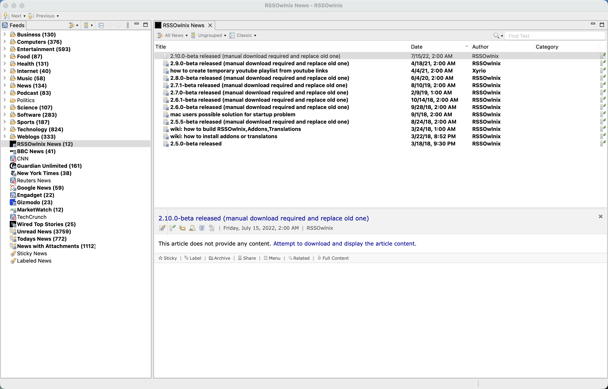

1. **Feeds tree (master)** — left pane: categories and feeds, selection drives the rest.
2. **Headlines "table" (detail list)** — top-right. Despite looking like a table it is actually a
   JFace `TreeViewer` over a custom `CTree`, because it can show rows **flat or grouped** (by
   feed/date/sticky). It has **sortable columns** (15 defined; Title / Date / Author / Category…
   visible), per-row state (bold = unread), custom owner-draw colors, in-cell interactive icons,
   and a context menu. *This is the component the whole experiment is really about.*
3. **Article reader (detail)** — bottom-right: renders the selected headline.

This maps onto Vaadin as: a `TreeGrid` (sorting, selection, renderers, context menu — and grouping
for free, since it's a superset of `Grid`) + a detail component bound to the grid's selection via a
Signal, wrapped in a `MasterDetailLayout`. The headline question — "can an SWT table with sorting
and a context menu move to a Vaadin Grid, and where does it break?" — is now concrete and visible,
and the design (and its lossy edges) is worked out below.

Other "before" screenshots captured:

- `before/rssowlnix-before.png` — first-run Welcome wizard (proves it launches under Rosetta).
- `before/rssowlnix-feeds.png` — the populated feeds tree mid-update.

### A tooling note worth recording

Capturing these screenshots was itself instructive about SWT on modern macOS: **the SWT window
does not expose an accessibility tree.** `System Events` button-clicks silently no-op and the
inner widgets (tree rows, table cells) aren't queryable. Only two things worked: resizing via
`set size of window 1`, and raw `key code` keystrokes to navigate the tree. To click a table
row we fell back to `cliclick` with coordinates (Retina 2× → logical point = screenshot pixel
÷ 2, verified with `screencapture -C` to show the cursor). Worth remembering if anyone tries to
UI-test a legacy SWT app.

---

## Scale of the slice (lines of code)

To keep "a representative slice, not the whole app" honest, here is the size of what we're actually
migrating versus the whole codebase (cloc, Java code lines only, in the RSSOwlnix source):

| Scope | Java code lines |
|---|---|
| Whole RSSOwl(nix) project | 121,261 |
| — of which **tests** (`org.rssowl.core.tests`) | 35,406 |
| — of which **production** code | **85,855** |
| `org.rssowl.ui` (the UI bundle) | 57,334 |
| `org.rssowl.core` (model/persistence/feed logic) | 28,521 |
| The master-detail slice (the 15 tree/table/reader files) | 9,000 |
| The headline table proper (6 files incl. `NewsComparator`) | 1,980 |

**A fair objection (raised in review): "how can this tiny app be 121k lines?"** Two things the
headline number hides. First, **~29% of it (35,406 lines) is test code** — production Java is
**~85,855 lines**. Second, that figure is what this 20-year-old **full Eclipse RCP** app already
*contains*, not what the product *needs*. The user-facing product is genuinely small (a feed
reader), but RCP RSSOwl ships its own infrastructure: object-database integration (db4o), full-text
search (Lucene), feed parsing (JDOM), an embedded browser, OPML import/export, a notification-popup
system, retention/cleanup, labels & stickies, saved searches, sync, and preferences — spread across
~167 OSGi bundles. (The bundled libraries db4o/Lucene/JDOM/HttpClient are JARs, so they add **0**
source lines here.) The UX is small; the machinery is not.

And that gap is the point. The slice we actually migrate is ~7% of the project; the headline table
at its center is ~2k lines — and *nobody rewrites 121k lines*. That ~2k lines is what the design
below sizes at **~13–18 person-days** to faithfully re-create in Vaadin — a useful ratio when
extrapolating: the visible widget is small, but its behavior (sorting, owner-draw, interactive
cells, context menu, selection wiring) is dense.

## Working method: the model's Vaadin knowledge is stale — query the MCP server

This experiment is as much about *how to use AI to do the migration* as about the migration
itself, so this trap is worth recording in full.

While sketching the master→detail mapping above, the assistant wrote that the Workbench
selection service "becomes explicit listener wiring" on the Vaadin side. That is **wrong for
Vaadin 25.** It reflects the model's training cutoff (January 2026) and the way Vaadin worked
for years — not the current platform.

The correction came from the human in the loop, and was then confirmed against Vaadin's own
**MCP server** (which the assistant had _not_ queried before making the claim — the first
mistake):

- Latest stable Vaadin is **25.1.8**, released **2026-06-15** — *after* the model's training
  cutoff. Anything the model "knows" about 25.1 is unreliable by construction.
- The Vaadin primer exists specifically to "address common AI misconceptions." Vaadin 25.1
  introduces **Signals**: reactive UI state with element-level binding.
- The docs demonstrate our *exact* use case — a Grid synchronized with a detail form via a
  `selectedItemSignal` plus `Signal.effect()` — and describe it as eliminating "complex event
  handling chains." So the modern wiring is:

  ```java
  // The selected headline is the single source of truth.
  ValueSignal<News> selected = new ValueSignal<>(null);
  grid.asSingleSelect().addValueChangeListener(e -> selected.set(e.getValue()));

  // The detail binds reactively — no manual "when selection changes, update X" plumbing.
  Span title = new Span();
  title.bindText(selected.map(News::getTitle));
  ```

**The lesson for the method:** treat the model's built-in framework knowledge as a *stale
cache*. For anything on the Vaadin side, query the MCP server **first** — `get_vaadin_primer`
and `search_vaadin_docs` for the target version — and prefer it over what the model
"remembers." We avoided shipping an outdated, listener-based design only because a human caught
it; the durable fix is to make the MCP query a required step, not an afterthought.

## Designing the headline-table migration (and switching to plan mode)

A process note, because this experiment is also about *how* to use AI well. Before writing any
Vaadin code for the headline table, the human deliberately switched the assistant into **plan
mode** — design first, code second. For a slice this dense (a `TreeViewer` masquerading as a
table, 15 columns, ~500 lines of custom comparator, heavy owner-draw, interactive in-cell icons,
a dynamically-rebuilt context menu), that paid off: planning surfaced the parts with *no clean
Vaadin equivalent* up front, instead of discovering them mid-implementation after the structure
was already committed. The design below was produced by exploring the real SWT/JFace source and
checking every Vaadin API against the MCP server (per the rule above).

**Target component — `TreeGrid<NewsRow>` for everything.** The SWT control is one `TreeViewer`
that is flat *or* grouped; Vaadin `TreeGrid` extends `Grid` and inherits all of its
sorting/selection/renderer/context-menu/styling features, so the flat case is just a tree with no
children — one codepath, no Grid↔TreeGrid swap. Backed by
`TreeDataProvider<>(treeData, HierarchyFormat.FLATTENED)` (FLATTENED keeps scroll position across
the frequent `refreshAll()` on mark-read/regroup). Rows modeled as a sealed
`NewsRow permits GroupRow, NewsItemRow`.

**The mapping, by concern:**

- **Data model** — immutable `record NewsItem(…)` with a stable `id` (Grid needs stable identity
  for selection/`refreshItem`). Filter/group/sort are pure functions over the master list,
  orchestrated by Signals; grouping = data-shaping into `TreeData`, sorting = per-column
  comparators (not pushed through the data provider for in-memory data).
- **Columns** — keep the `NewsColumn` enum as the metadata registry; build columns in a loop with
  `setKey(column.name())`. Visibility/order/width via `setVisible`/`setColumnOrder`/`setWidth`+
  `setFlexGrow`. The `CColumnLayoutData` fill-% widths are *approximated* by flexGrow ratios.
- **Sorting** — port each `NewsComparator` branch to a `Comparator` on
  `Column.setComparator(...).setSortable(true)` (dates `nullsLast`, `CASE_INSENSITIVE_ORDER`,
  status-rank, booleans, labels-by-order). Header-click toggle + sort triangle are built into
  Grid (the SWT `setSortColumn/Direction` code is *deleted*, not ported). Restore persisted sort
  via `grid.sort(GridSortOrder…)`.
- **Rendering — different mechanism per effect:** bold-unread and sticky full-row background →
  `setPartNameGenerator` + global CSS (row bg via `--vaadin-grid-cell-background`); state/feed/pin
  icons → renderers, with **`ComponentRenderer` confined to the TITLE column** (one component per
  cell is costly) and `LitRenderer` for static icons; arbitrary per-row **label color** → inline
  style on rendered content (can't be enumerated as CSS parts).
- **Interactive icons** — SWT pixel hit-testing becomes real clickable sub-elements: `LitRenderer`
  `@click`+`withFunction` for toggle-read / toggle-sticky (must `stopPropagation` so it doesn't
  also select the row), a small menu for attachments. Double-click → `addItemDoubleClickListener`.
- **Selection → detail** — drop the workbench selection-service indirection entirely; a
  `ValueSignal<NewsItem> selected` set by `grid.addSelectionListener`, with the reader reacting via
  `Signal.effect(...)`, all wrapped in `MasterDetailLayout`.
- **Context menu** — `GridContextMenu` + `setDynamicContentHandler(row -> …)` mirrors the JFace
  `MenuManager.setRemoveAllWhenShown`/`menuAboutToShow` rebuild.

**Lossy / hard / not 1:1 (the honest core, found *before* coding thanks to planning):**

1. **Full-row label-color-on-select owner-draw** — the hardest: arbitrary per-row hex *and*
   selected state can't compose through enumerable CSS parts. Expect a design compromise.
2. **Alternating per-row gradient** — only flat `ROW_STRIPES` is built-in; the gradient is lossy.
3. **In-cell icon click vs. row click** — needs `stopPropagation`; a behavioral edge to test.
4. **Auto-mark-read-after-delay** — SWT used a UI-thread timer; the web needs `@Push` +
   scheduled task + `ui.access` + cancel-on-reselect. Race-prone, not free.
5. **Multi-select range/anchor semantics** — reproducible, not identical.
6. **Column-state persistence** — no built-in Grid state store; must be re-implemented.
7. **`MB_ADDITIONS` extension contributions** — Eclipse let *other plugins* add menu items
   declaratively. **No web equivalent** — an architectural capability that is simply lost.

**Effort for this sub-slice, with AI assistance: ~13–18 person-days.** Top risks: (1) the
owner-draw selection paint, (2) auto-mark-read + multi-select over the wire, (3) discovering lost
extension-point menu contributions late.

## Building & verifying the POC (Vaadin 25.1)

The POC lives in [`../poc/headlines/`](../poc/headlines/): a Vaadin **25.1.8** Flow app
(Spring Boot 4.0.7, Aura theme, `@Push`), scaffolded from `start.vaadin.com/skeleton`. Run it with
`cd poc/headlines && ./mvnw spring-boot:run` → <http://localhost:8080> (build/run with a JDK 21).
It started as a flat `Grid<NewsItem>` over a 9-row fixture; it has since been **deepened** to a
`TreeGrid<Row>` showing **live headlines from RSSOwl's own default feeds**, with **grouping** — see
"Deepening" below. (The fixture remains as an offline fallback.)

We then drove the running app with the **Playwright MCP** as the verification harness. "Before"
(native SWT) on the left in spirit; "after" (Vaadin, in the browser) below:

| What | After (Vaadin 25.1) |
|---|---|
| Default view — bold-unread, state icons, label-coloured titles, **sticky rows highlighted**, toggle icons | 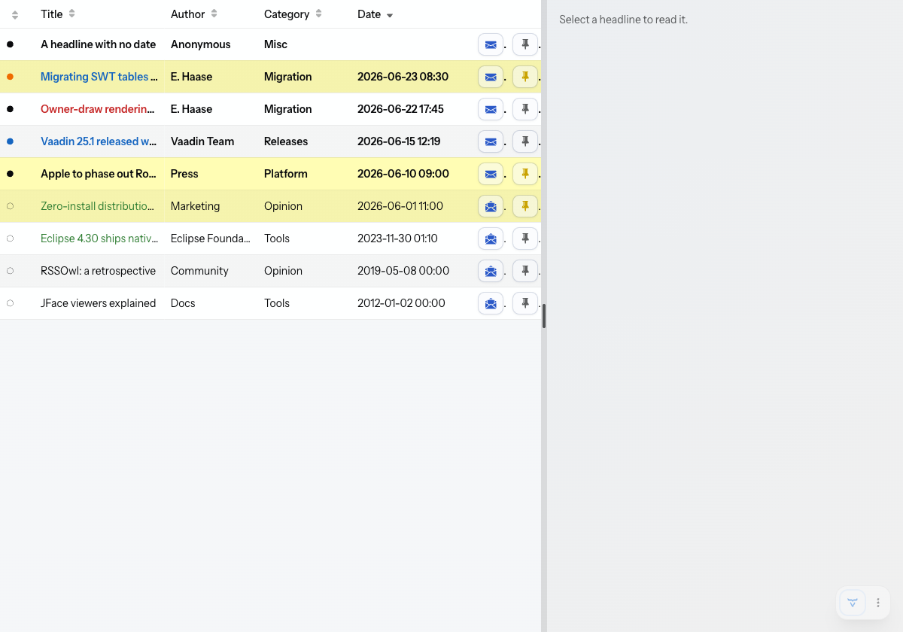 |
| Sort by Title (header click) | 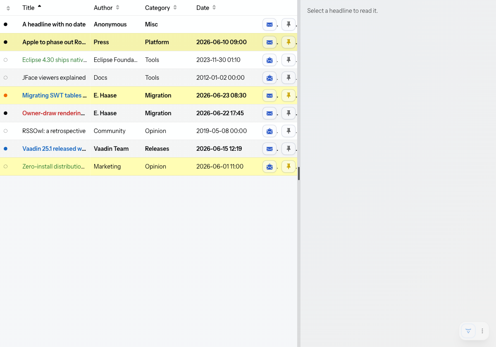 |
| Master→detail via a Signal | 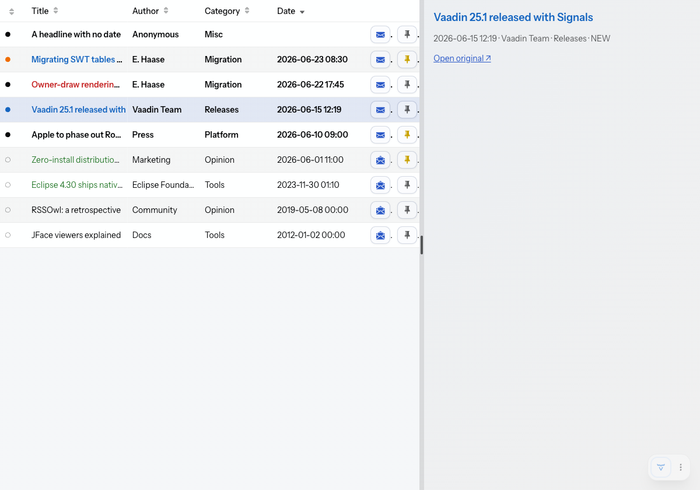 |
| Dynamic `GridContextMenu` (per-row text) | 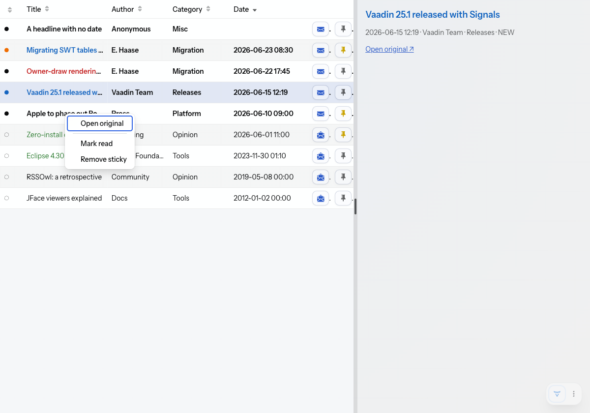 |

### Deepening: real RSS feeds + grouping (TreeGrid)

Three follow-ups took the PoC from a fixture to the real, full RSSOwl shape:

**1. Real feeds — RSSOwl's own defaults.** RSSOwl's "Import Recommended Feeds" first-start option
loads a bundled OPML (`org.rssowl.ui/default_feeds.xml`, 77 feeds). That file is from **2009** and
most URLs are dead, so we ship our own `feeds.opml` mirroring its category structure — the same
alphabetical folders (Business, Entertainment, Health, Politics, Science, Sports, Technology, World)
— populated with **current** section feeds from reliable publishers (BBC, Guardian, NYT, NPR, …).
A `FeedService` (Rome parser) fetches them concurrently with per-feed timeouts, de-dupes, and maps
entries to `NewsItem`; if every feed fails (offline/CI) it falls back to the fixture behind a banner.
A live run logged **"Loaded 800 headlines from 26 feed(s)"** in ~5s.

**2. Grouping via `TreeGrid`.** The flat `Grid` became a single `TreeGrid<Row>` (sealed
`Row = GroupRow | ItemRow`), with a "Group by" selector (None / Date / Status / Author / Category /
Feed / Sticky). Grouping is data-shaping into group parents over item children — flat mode is just a
tree with no children, one codepath. This is exactly the design's "TreeGrid is a superset of Grid".

**3. The full three-pane RSSOwl layout.** On request, the PoC was restructured to match RSSOwl
structurally: a **left feeds-navigation tree** (`BookMarkExplorer` equivalent), a **top-right
headlines** grid, and a **bottom-right reader** — nested `SplitLayout`s. The tree mirrors RSSOwl's
`default_feeds.xml`: the same **category folders** (Business, Computers, Entertainment, Health,
News, Politics, Science, Sports, Technology, **Weblogs**) plus the **ungrouped top-level channels**
that sit beside them (Gizmodo, Engadget, Google News, MarketWatch, …), each with a count. Selecting
a category or feed filters the headlines; a second `TreeGrid` (the feeds tree) drives the first.

> *Self-correction:* the first cut of this invented my own category set (incl. a non-RSSOwl "World",
> no "Weblogs", and no ungrouped channels). Caught in review — now aligned to RSSOwl's actual taxonomy.

| What | After (Vaadin 25.1, live data) |
|---|---|
| **Three-pane layout** — full feeds tree (15 folders + channels + smart folders) ‖ headlines ‖ reader | 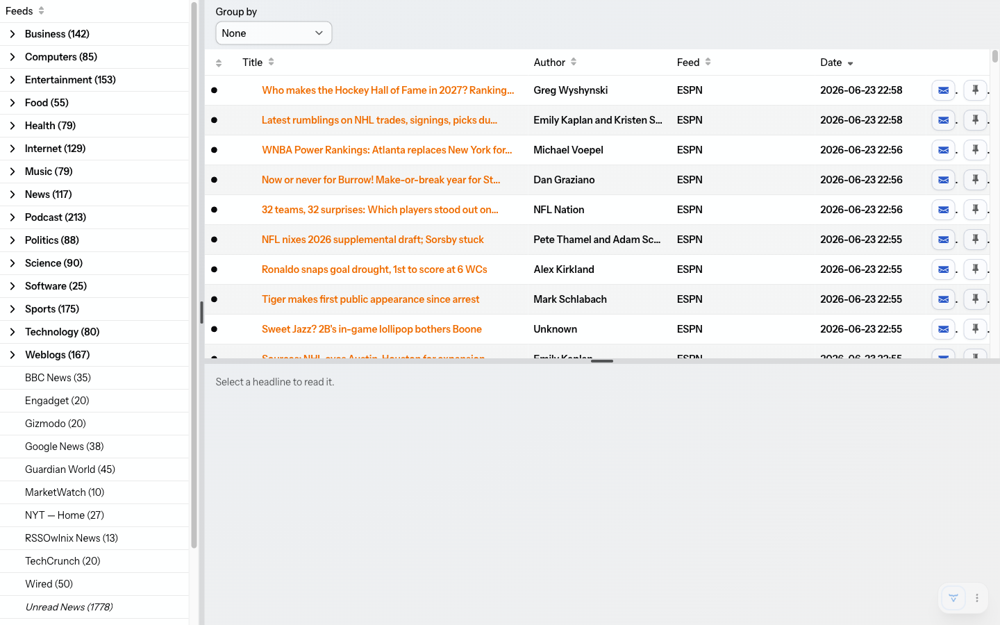 |
| In use — select a headline, reader fills via a Signal | 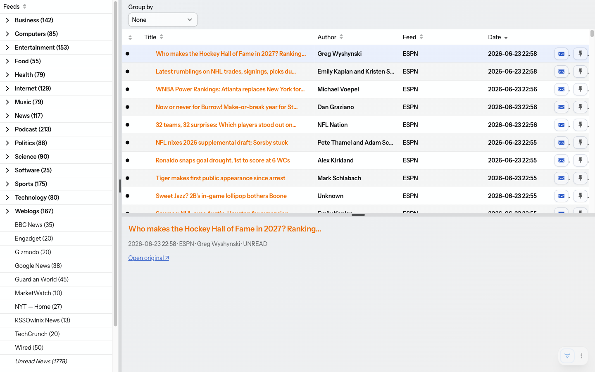 |
| Click a feed → headlines filter to it (BBC Business) | 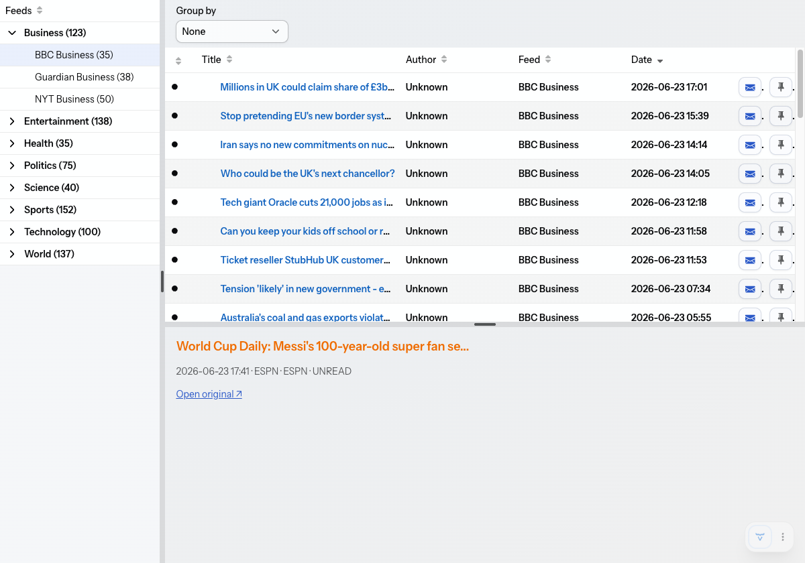 |
| Saved-search smart folder selected (News with Attachments) | 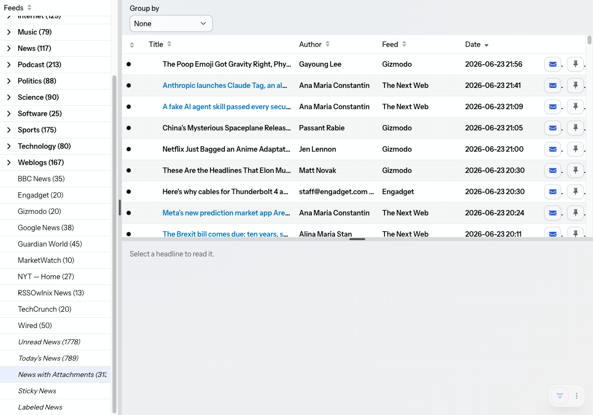 |
| Group by **Feed** — bold group headers with counts, items nested & date-sorted | 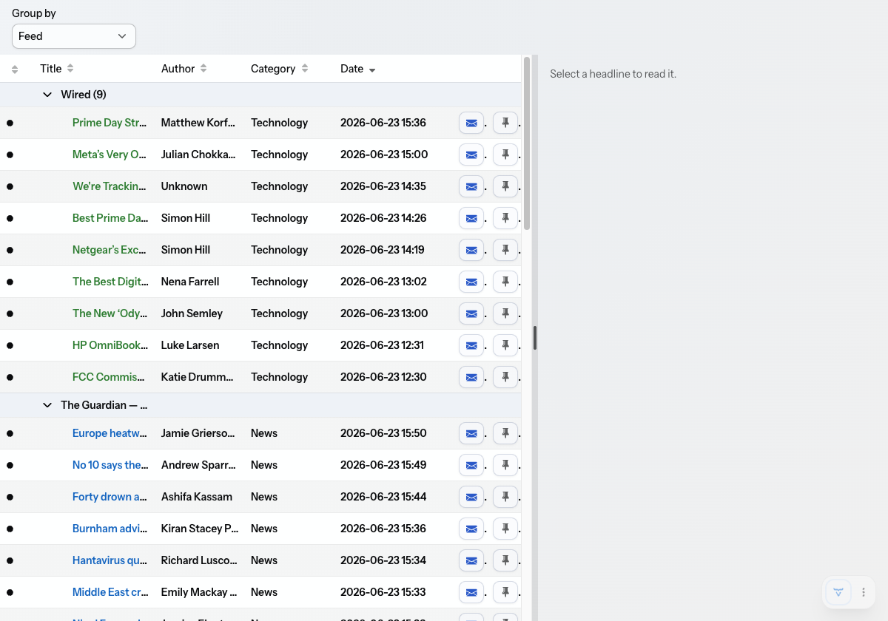 |
| Live headlines from the default feeds | 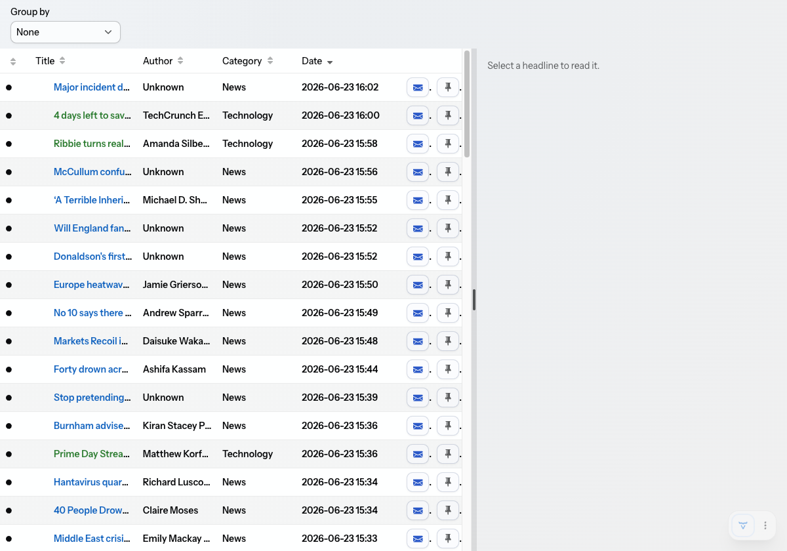 |

Verified via Playwright: the left tree lists RSSOwl's category folders with real counts plus the
ungrouped channels below them; selecting a feed filters the middle pane; grouping nests items under
bold counted headers; selection→detail works on the TreeGrid (Signals); right-clicking a **group**
row shows **no** context menu (`setDynamicContentHandler` returns `false`). Honest notes: counts are
**real** (driven by what the live feeds return — not the literal "151" from RSSOwl's old screenshot);
some feeds fail and are skipped (e.g. **CNN's `rss.cnn.com` dropped the SSL handshake**, so it shows
no rows — the graceful-skip path in action); with all-fresh items **Date grouping collapses to one
"Today" bucket**; BBC sets no per-item author ("Unknown") and Engadget exposes a raw `staff@…`
author — real RSS is messy. One runtime bug surfaced only by running it: `TreeGrid` throws
*"Cannot add the same item multiple times"* when feeds repeat a link — fixed by de-duping items by a
stable 64-bit id before building the tree.

### Fidelity gap: fewer channels than the original (caught in review)

Comparing the running Vaadin tree against the RSSOwl "before" screenshot side by side, the human in
the loop noted: *"there are fewer channels in the Vaadin version. Why?"* — a fair hit, and worth
recording because it's the recurring shape of this experiment (the AI silently under-delivers
fidelity; a human who knows the original has to keep checking). The first cut had ~14 top-level rows
vs RSSOwl's ~32. Four reasons, none "Vaadin can't" — and three are now closed in review:

1. **~~Dropped 5 of 15 category folders~~ (Fixed.)** Food, Internet, Music, Podcast, Software are now
   present too — all **15 RSSOwl categories** with current best-effort feeds (a few feeds are flaky,
   e.g. Smitten Kitchen returns malformed XML and is skipped).
2. **Ungrouped channels under-represented (Fixed.)** RSSOwl lists BBC News, NYT, Guardian, TechCrunch,
   Wired *both* inside folders *and* as loose channels; a `FEATURED` set now surfaces them as
   top-level channels too (no data duplication). Still absent: **CNN** (SSL handshake fails) and
   **Reuters** (killed public RSS).
3. **~~No saved-search smart folders~~ (Fixed.)** RSSOwl's Unread News / Today's News / News with
   Attachments / Sticky News / Labeled News are *saved searches*; the tree now shows all five at the
   bottom as computed `FeedNode.Saved` filters over all items (Attachments uses RSS enclosures —
   so podcasts/media match). **"Labeled News" is an honest stub** (count 0): the PoC has no
   user-label feature — the title colours are per-category, not user labels.
4. **~~Counts arbitrary~~ (Fixed — copied RSSOwl's actual limit.)** Asked "is there a MAX_ITEMS in the
   old software?", we found RSSOwl's `PreferencesInitializer`: count-based cleanup is **on by default**
   at **200 news per feed** (`DEL_NEWS_BY_COUNT_VALUE = 200`). The PoC now applies that exact
   **per-feed 200 cap** instead of an arbitrary global number, so per-category counts are real and
   RSSOwl-scaled (Business 142, Podcast 213, Sports 175, Weblogs 167, …). Still differs from RSSOwl's
   *accumulated unread over time* — one live fetch ≠ years of retained articles.

So the tree now matches RSSOwl structurally: **15 category folders + ~10 ungrouped channels + 5
saved-search smart folders**, governed by RSSOwl's own 200/feed limit. What's left is genuinely
unavailable, not unbuilt: two dead endpoints (CNN's SSL, Reuters' removed RSS) and the "Labeled
News" stub (no user-label feature in the PoC). All four review-caught reasons are now closed or
explained.

The honest takeaway for "can AI do this migration?": yes mechanically, but it will quietly produce a
*plausible-looking* approximation that's missing pieces only someone familiar with the original will
spot. The migration tooling reproduces structure; faithful *completeness* still needs human review.

### Where it landed (end of day 1)

The last step closed the loop from "a flat list of headlines" to **the recognizable RSSOwl screen**:
a three-pane layout whose left tree carries all 15 category folders, the loose top-level channels,
and the five saved-search smart folders — over **live** headlines from RSSOwl's own default feeds,
capped by RSSOwl's own 200/feed rule. Set the "before" (native SWT, `docs/before/`) beside the
"after" (`docs/after/threepane-layout.png`, `threepane-reading.png`) and they read as the same
application — one desktop, one in a browser tab, no install.

What that took, honestly: the *structure* came quickly with AI + the Vaadin MCP, but **every gap
between "looks right" and "is right" was closed by human review**, not by the model noticing — the
stale Signals API, the dead-toolkit over-claim, the invented feed taxonomy, fewer channels, and the
arbitrary item cap. That is the experiment's central finding, and the most useful thing to tell an
architect weighing this migration: the tooling gets you a faithful skeleton fast; a person who knows
the source app turns it into a faithful *app*. The behavioral long-pole items (multi-select range
semantics, the auto-mark-read timer, column persistence, real user-labels, owner-draw selection
paint) remain — sized in the design section, and the honest reason the full sub-slice is ~13–18 days,
not an afternoon.

### What the AI got right, first try
- The whole structure compiled after **two** real API fixes (below) and ran first launch.
- **Signals master→detail just worked**: `grid.addSelectionListener` sets a `ValueSignal<NewsItem>`,
  `Signal.effect(detail, …)` rebuilds the reader. No listener plumbing on the detail side — exactly
  what the MCP docs promised, and visibly cleaner than the RCP selection-service indirection.
- **Sorting**: header-click sort + the sort triangle came free from `Grid` once each column had a
  `setComparator(...)` — the ~500-line `NewsComparator` collapses into a handful of one-liners.
- **`GridContextMenu` + `setDynamicContentHandler`** reproduced the per-open menu rebuild faithfully
  ("Mark read"↔"Mark unread", "Make/Remove sticky").
- **bold-unread** (part-name generator + `::part(unread){font-weight}`) and **label colours**
  (inline style on the title cell) rendered correctly.

### What it got wrong / what running it surfaced (the honest part)
- **Two compile errors from stale-model API guesses** (caught by `javac`, not by me): `new
  ValueSignal<>()` won't infer from a field (needs `new ValueSignal<NewsItem>((NewsItem) null)`);
  and the Grid **item-double-click** event's `getItem()` returns `T` directly while the
  **context-menu** event's returns `Optional<T>` — a genuine Grid API inconsistency.
- **The documented row-background technique is wrong under Aura.** The MCP styling docs say set
  `--vaadin-grid-cell-background`; we did, the custom property *was* set on the cell — but the
  computed background stayed white. Under the new **Aura** theme the cell background is painted
  independently; only `background-color: … !important` on `::part(sticky)` worked. This is the
  "owner-draw is the hardest" prediction coming true — milder than feared (a one-line CSS fix) but
  it cost a real debugging loop and only surfaced by *running and inspecting the shadow DOM*.
- **`nullsLast` flips under descending sort** _(fixed — Day 8)_. RSSOwl always sorts null dates last;
  in Vaadin the comparator is reversed for descending, so the null-date row sorted *first* under the
  default date-desc sort. Fixed with a direction-aware comparator: hand the grid a **nulls-first**
  comparator for descending (so its reversal lands nulls last), swapped via a `SortListener`. See "Day 8".
- **Lumo theme variants don't apply under Aura** (`GridVariant.LUMO_ROW_STRIPES` showed no stripes).
- **`MasterDetailLayout` has no Java API in the MCP** (lookup errored), so the POC used
  `SplitLayout`. Re-confirms the MCP is current but not exhaustive for the newest components.
- **Dev-loop friction:** editing `styles.css` did nothing until an app restart — `spring-boot:run`
  serves the stale `target/classes` copy. Worth knowing before chasing phantom CSS bugs.

### Effort, honestly
This POC is a *subset*: flat (no grouping/TreeGrid), single-select, no auto-mark-read timer, no
column persistence, a trimmed column set. Even so it exercised the core question and took roughly
half a focused day with AI assistance. The full ~13–18-day estimate for the complete sub-slice
(§ design) still stands — the long pole is the items this POC deliberately left out plus the
owner-draw fidelity, not the parts shown here.

### Day 2 — drag-and-drop feed reordering (and a doubt worth recording)

The original RSSOwl lets you drag channels around the feeds tree with the mouse; the POC's tree was
static. Added it: only **channels** (Feed nodes) are draggable — category folders and saved-search
folders stay put (`setDragFilter`) — and a drop either reorders a channel among its siblings, drops
it *into* a folder (release on top of one), or pops it back out to the top level. Implemented by
moving the tree off the immutable `setItems(roots, childProvider)` form onto a mutable
`TreeData` + `TreeDataProvider`, then `setParent` / `moveAfterSibling` + `refreshAll()` on drop.
Verified by driving a real HTML5 drag in the browser: RSSOwlnix News reordered above BBC News, and
Wired dragged into the Business folder (and left the top level).

Two things this surfaced, both honest:

- **A latency trap in the documented pattern.** Vaadin's official example sets the drop mode *inside*
  `dragStart`. Because `setDropMode` only reaches the client after a server round-trip, the very first
  drop after grabbing a row can be missed if you release quickly. Setting the drop mode **once at
  setup** (it has no visible effect except during an active drag) removed the flakiness. This only
  became visible by testing the drag programmatically with no human-scale pause between grab and drop.

- **A doubt the user raised, recorded verbatim:** *"you are removing HierarchyFormat.FLATTENED and I
  wonder why? We do want a stable tree, especially when // FLATTENED keeps scroll/expansion stable
  across refreshAll() after a drag."* The doubt was correct and caught a real mistake. I had dropped
  `HierarchyFormat.FLATTENED` only because the import wouldn't compile — the wrong reason to abandon a
  feature we want. Investigating showed the class **does** exist in the resolved jar (flow-data
  25.1.7); it is a **nested** type, `HierarchicalDataProvider.HierarchyFormat`, not the top-level
  `com.vaadin.flow.data.provider.hierarchy.HierarchyFormat` the MCP doc's import comment implied
  (`javap` confirmed both the constant and the `TreeDataProvider(TreeData, HierarchyFormat)`
  constructor). FLATTENED was restored with the correct import. **Finding:** the MCP docs were right
  that the feature exists, but the *import path shown was wrong* — and "it didn't compile" is not a
  valid reason to remove desired behaviour; the fix is to find out *why* it didn't compile.

### Day 3 — multi-user (Keycloak SSO + per-user data), on branch `multi-user`

The single-state PoC became a real multi-user app: **OIDC login against an existing Keycloak** (Spring
Security OAuth2 client; identity = the Keycloak subject) over **Spring Data JPA + H2**, with everything
per-user — subscriptions, feed folders, drag order, and read/sticky/label state — seeded from the
default `feeds.opml` on first login. The data model splits *shared* (`Feed`, `Article`, fetched once)
from *per-user* (`Subscription`, `ArticleState`, keyed by subject). The view (`HeadlinesView`) reads
the logged-in user via Vaadin's `AuthenticationContext`, with a "Signed in as … / Log out" header.

Verified end-to-end in the browser with two Keycloak users: alice and bob each get their own
subscriptions; alice marking an article read **persists across reload** (it's in H2) and does **not**
affect bob; dragging a channel to a new position/folder **persists per user** (confirmed in the DB —
each owner has independent `Subscription` positions); adding a feed (`https://hnrss.org/frontpage` →
"Hacker News") fetched 52 articles and appeared in the tree, surviving reload.

Honest findings from this slice:
- **Vaadin 25 changed the security API.** The base class `VaadinWebSecurity` is gone; you configure a
  `SecurityFilterChain` with `VaadinSecurityConfigurer` + `oauth2LoginPage(...)`. Following a pre-25
  tutorial would not compile. (Confirmed against the MCP docs and the jar.)
- **Views need an explicit access annotation.** After enabling security, an authenticated user still
  got "Consider adding @AnonymousAllowed / @PermitAll" — the view must be annotated (`@PermitAll`).
- **Keycloak's default `sslRequired=external` blocks plain-HTTP OIDC** from non-localhost — both the
  server's discovery fetch *and* the browser login redirect. For a dev realm over http you must set
  `sslRequired=NONE` (or put TLS in front). Diagnosed from a `403 {"error_description":"HTTPS
  required"}`; a one-shot `kcadm` script (`keycloak/setup-keycloak.sh`) creates the realm/client/users
  and relaxes it.
- **Secrets discipline:** the auto-mode safety classifier (correctly) blocked putting the client
  secret inline on a command line; it now lives in a git-ignored `.env.local` sourced by `run.sh`.
- **Restart auto-SSO gotcha:** after a server restart the browser silently re-logs-in the *last*
  Keycloak user (SSO cookie still valid). This briefly looked like a data leak until the DB showed each
  user's rows were correctly independent — a reminder to check identity, not assume it, when verifying
  multi-user behaviour.
- **Vaadin `GridContextMenu` doesn't open under Playwright's synthetic right-click** (reproduced on
  the known-working headlines menu), so the "Unsubscribe" item is verified by parity with that menu
  rather than by automation — a real right-click works for a user. A genuine limitation of the test
  harness, not the app.

**Per-feed authentication** (parity with RSSOwl's per-bookmark credentials). Feeds can require a
login: each `Subscription` carries optional username/password; the fetcher sends HTTP Basic auth and,
on a 401, raises `AuthenticationRequiredException` (parsing the `WWW-Authenticate` realm) so the UI
prompts "Feed requires authentication". Credentials are set in the Add-feed dialog or a "Set
credentials…" context item; authenticated feeds show a 🔒. Verified against `httpbin.org/basic-auth`:
no credentials → 401 → the auth-failed prompt; correct credentials → the request is accepted (the
header works; httpbin's JSON then fails RSS parsing, as expected).

**Per-user isolation of authenticated feeds — a security fix caught in review** ("No way is it
acceptable to share feed credentials between users"). The first cut fetched auth-gated feeds in the
*shared* background refresh using one subscriber's stored credentials, into the shared article pool —
leaking both the credentials (used on others' behalf) and the private content they unlock. Corrected:
the shared refresh now fetches every feed **anonymously** (never with stored credentials), so
auth-gated feeds 401 there and are skipped; `Article` gained an `owner` (null = public/shared, else
the Keycloak subject) with `(feed, link, owner)` uniqueness; authenticated feeds are fetched **per
user with their own credentials** and stored private to that subject; a user's headlines are public
articles **plus only their own** private ones. Verified end-to-end with a local Basic-auth RSS server:
alice (with credentials) sees the feed's items, stored `owner = alice` in the DB; bob — same URL,
*no* credentials — sees the feed with **0** articles and **none** of alice's content.

Credentials are **encrypted at rest** (AES-256-GCM via a JPA `AttributeConverter`, key from
`APP_CREDENTIAL_KEY`), not stored in clear text. And **folder reordering is persisted per user** too:
category folders are draggable (a `FolderPref` entity stores their order), alongside the existing
per-user channel order — both survive logout/restart.

**Where the slice stands vs the original (asked directly: "no gap any more?").** No — not feature
complete, and this report won't pretend otherwise. The targeted slice is faithful (three-pane feeds
tree → sortable/groupable headlines → reader, with read/sticky, **per-user labels**, **headline
search**, retention cap, smart folders, drag-reorder of channels *and* folders, add/unsubscribe,
per-feed auth) and we added what the desktop app lacks (multi-user, Keycloak SSO, per-user isolation,
zero-install web). But RSSOwl the *application* still has whole subsystems we deliberately didn't
build: news filters/actions, notifications, OPML import/export UI, scheduled per-feed refresh, keyboard
navigation, news bins, and sync. Labels are a basic single-colour-per-item subset. Faithful on the slice; a fraction of the
whole app — exactly the honest scope this experiment set out to measure. _(Update, Days 7–17: nearly all
of this list was subsequently built — inline article rendering (Day 7), Lucene full-text search (Day 9),
OPML import/export UI (Day 10), notifications (Days 11/13), scheduled refresh (Day 12), the news
filters/actions rules engine (Day 14), label management — custom + multi-label (Day 15), saved searches
(Day 16), and news bins (Day 17). What's left is genuinely out of scope or impossible on the web:
keyboard navigation (polish) and sync (a dead API). See the per-day sections below.)_

**A clarification worth recording (it was nearly mis-stated as a finding).** RSSOwl is *not* "mostly
SWT scaffolding" — SWT isn't even in its 121k lines (it's an external Eclipse dependency); its own
code is the UI bundle + model + ~29% tests, and the hard part is the **RCP/JFace** layer, not the SWT
widgets. The accurate, related observation is that the SWT/JFace **UI plumbing is verbose and
collapses sharply in Vaadin**: the ~500-line `NewsComparator` became a handful of `setComparator(...)`
one-liners, owner-draw rendering became a little CSS, and JFace content/label-provider ceremony
disappears into `Grid` renderers. That compression is real and quotable — but it's about the JFace
boilerplate shrinking, not the application being "mostly scaffolding."

### Day 4 — column persistence (order / width / visibility)

Closed one of the open stretch items: the headlines grid now remembers each user's **column order,
widths, and which columns are shown** across logout/restart — exactly what RSSOwl persists on its
`NewsColumn` model. The Vaadin side is small and declarative: `grid.setColumnReorderingAllowed(true)`
plus `column.setResizable(true)`, two listeners (`addColumnReorderListener`, `addColumnResizeListener`),
and a "Columns" menu of checkable items for visibility. A new per-user `ColumnPref` entity
(`owner, colKey, position, width, visible`, mirroring the existing `FolderPref`) stores the layout;
any of the three gestures snapshots the full column state and upserts it, and the saved layout is
re-applied on view load via `grid.setColumnOrder(...)` + `setWidth`/`setVisible`. Total new code is
about one entity, one repository, two short service methods, and ~40 lines of view wiring — the
persistence model is the same owner-keyed pattern already proven for subscriptions and folders.

Honest findings from this slice:
- **The reorder/resize APIs are exactly where you'd expect, and current.** The MCP docs (Vaadin 25.1)
  confirmed `setColumnReorderingAllowed` / `setResizable` and the resize-event flow; no stale-API
  surprises this time. The one design choice worth noting: a *resized* column becomes fixed-width
  (`setFlexGrow(0)`), matching RSSOwl, so a restored width sticks instead of being overridden by flex.
- **Playwright still can't drive Vaadin's header drag — and now neither its overlay menu via click.**
  A synthetic header-to-header `dragTo` did **not** trigger Vaadin's column reorder (same family as the
  documented `GridContextMenu` gotcha), and clicking the "Columns" menu-bar item opened an overlay that
  closed before it could be asserted. **Keyboard navigation was the reliable path**: focus the menu
  button, `Enter` to open, `ArrowDown` + `Enter` to toggle an item. That drove the real server round-trip.
- **Verified end-to-end the way that *does* work.** Hiding the **Feed** column via the keyboard-driven
  menu removed it from the grid; after a **full page reload** (Keycloak re-auth included) the column
  stayed hidden — proving the `column_pref` save and the on-load restore. Toggling it back produced a
  clean default again. Per-user isolation is covered by a service test (alice's hidden column does not
  affect bob), alongside order/width round-trip and idempotent-upsert tests — **34 tests green** (was 31).
- **The honest limit:** column *reorder* and *resize* persistence share the identical save/restore path
  as visibility (same listener → `saveColumnLayout` → `applyColumnPrefs`) and are unit-tested, but the
  drag *gestures themselves* were confirmed by code + tests rather than by browser automation, because
  the harness can't synthesise them. A human dragging a header sees it persist; Playwright can't perform
  that drag.

### Day 5 — multi-select + auto-mark-read (two more stretch items, two real gotchas)

Closed two more of the open stretch items, and both surfaced genuine Vaadin findings worth recording.

**Multi-select.** Switched the headlines grid to `SelectionMode.MULTI` so several headlines can be
selected and acted on at once (mark read/unread, sticky, label) — like RSSOwl's news table. Context-menu
actions now operate on the whole selection when the right-clicked row is part of it (else just that row),
and the menu labels show the count, e.g. *"Mark read (12)"*. New `setRead`/`setSticky` setters on
`NewsItem` back the bulk path; a browserless test asserts the grid uses `GridMultiSelectionModel`.

- **Gotcha — in MULTI mode a row-body click no longer selects (only the checkbox does).** That silently
  broke the master-detail flow: clicking a headline stopped opening it in the reader (verified:
  `selectedItems = 0`, reader empty after a row click). The fix is to **decouple reading from selecting** —
  wire the reader (and the auto-read timer) to `addItemClickListener`, and let the checkbox column drive
  the multi-selection that bulk actions read via `getSelectedItems()`. Clicking reads; checking selects.

**Auto-mark-read.** RSSOwl marks the displayed article read after a short delay; a toolbar checkbox
("Mark read after viewing", on by default) gates it. On selection the view arms a 2-second task on a
shared daemon scheduler; when it fires it marks the item read **only if it's still the shown item and
still unread** (so skipping quickly past headlines doesn't mark them). The result reaches the browser via
`@Push` + `ui.access`. A detach listener cancels any pending task.

- **Gotcha — `Signal.get()` throws outside a reactive context (Vaadin 25 Signals).** The first cut read
  the current article with `selected.get()` inside the `ui.access` callback and got
  `IllegalStateException: Signal.get() was called outside a reactive context`. `get()` sets up dependency
  tracking and is only legal inside a `Signal.effect`/computed; from a plain callback (the timer, a
  checkbox listener) you must use **`selected.peek()`** (or `Signal.untracked(...)`). This is the *second*
  distinct Signals-API surprise in this experiment (the first was the listener-vs-Signals design itself) —
  reinforcing that the model's pre-25 Signals knowledge is unreliable and the running app is what catches it.
- **Verified end-to-end:** clicking a headline opened it in the reader (proving the item-click rewire), and
  ~2s later its row toggle flipped from "Mark read" to "Mark unread" via push — confirmed in the browser
  after the `peek()` fix; the server log went from a stack trace per fire to clean.

### Day 6 — mirroring the original's default tree exactly (nested folders)

To compare side-by-side with the running original, a new user (Alice) is now seeded from **RSSOwl's own
first-run OPML** — `org.rssowl.ui/default_feeds.xml`, copied verbatim into the PoC (EPL-1.0, attributed in
`NOTICE`) — instead of our earlier hand-built 51-feed taxonomy with current URLs. That tree is **15
top-level folders, 16 sub-folders, and 292 feeds**. Verified in the browser: Alice's tree now shows the
same 15 folders + 12 loose top-level channels + the 5 smart folders, and expanding *Computers* reveals
*Windows / Linux / Mac / PDA* (then its direct feeds) — the original nesting and OPML order, 1:1.

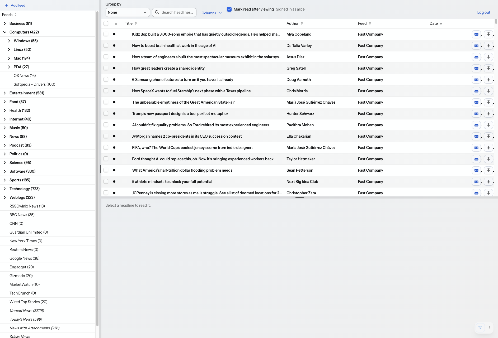

### Day 7 — the reader actually reads now (inline article content)

Until now the bottom pane showed only the title, a metadata line, and an "Open original" link — RSSOwl's
equivalent is a full **embedded SWT `Browser`** rendering the article. We closed most of that gap the
web-native way: the fetcher now keeps each entry's **feed-supplied HTML** (ROME's Atom `<content>`,
falling back to RSS `<description>`) on `Article`, carried through to the reader, which renders it inline.

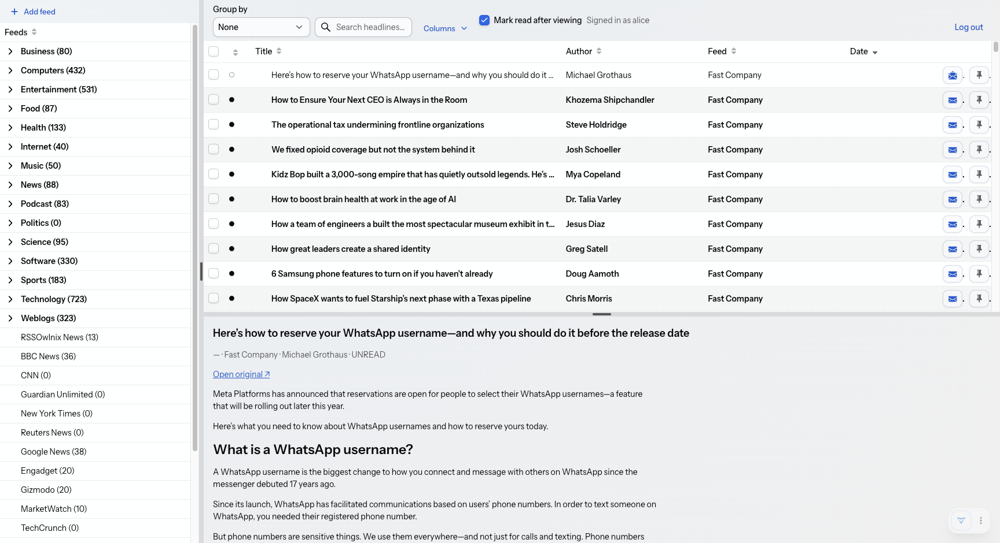

The honest details:
- **It renders the feed's content, not a live web page.** Most feeds ship a full article or a decent
  summary in `<content>`/`<description>`; that's what shows. It is *not* a browser loading the original
  URL — see the caveat below for why true page-embedding is impractical.
- **Vaadin's `Html` does not sanitize — that's a documented footgun.** The component injects raw markup;
  the Vaadin security docs say so explicitly and recommend **jsoup**. So feed HTML is cleaned through a
  jsoup "relaxed" allow-list (no `<script>`/`<style>`/inline event handlers/`javascript:` URLs) in a
  small `ArticleHtml.sanitize(...)` util, links forced to `target="_blank" rel="noopener"`. Covered by
  `ArticleHtmlTest` (script/`onerror`/`javascript:` stripped, formatting kept) — **39 tests green**.
- **Why not a real embedded browser (an `<iframe>` of the original URL)?** Most news sites send
  `X-Frame-Options: DENY` or a CSP `frame-ancestors` directive, so the frame renders blank. RSSOwl's
  desktop `Browser` widget has no such restriction; a web app does. Rendering the feed's own content is
  the reliable equivalent, with "Open original ↗" still there for the full page.
- **Storage + a migration note:** the body is a CLOB (`@Lob`) on `Article`. Because the fetcher
  de-duplicates, *existing* rows aren't back-filled — content only lands on a fresh fetch, so the H2 DB
  was recreated (the 2009 feeds that still resolve now carry article text; dead ones stay empty).

### Day 8 — direction-aware null sorting (the last in-slice stretch item)

The final stretch item, and a clean illustration of an SWT-vs-Vaadin model difference. RSSOwl's
`NewsComparator` is *direction-aware*: it always sorts undated items last, whichever way the date column
is sorted. Vaadin's model is different — you give a column **one** comparator and the grid **reverses it**
for a descending sort. So a `nullsLast` comparator becomes `nullsFirst` under descending, and undated
rows jumped to the top of the default newest-first view.

The fix is small once the model is clear: hand the grid a **nulls-first** comparator for descending (so
its own reversal lands the nulls *last*, dates newest-first) and **nulls-last** for ascending — swapping
between them in a `SortListener` (with a re-entrancy guard) and re-applying on the forced default sort.
The exact semantics are pinned by `DateSortNullPolicyTest`, which simulates the grid's reversal:
descending → newest first, undated still last. **41 tests green.**

Honest note: this is a *workaround for a framework default*, not a Vaadin shortcoming per se — but it's
exactly the kind of subtle behavioural fidelity that a naïve port gets wrong and only a reviewer who
knows the original would catch. With this, every in-slice stretch item from the original plan is done;
the remaining gaps (filters/actions, notifications, OPML-UI, news bins, sync) are whole out-of-slice
subsystems.

What this took, and the honest caveats:
- **The folder model had to grow from flat to nested.** Subscriptions store a folder *path*
  (`"Computers/Windows"`); the OPML parser walks ancestor `<outline>`s to build it; the tree renderer
  recurses, interleaving sub-folders and feeds at each level by their OPML position so the order matches
  the source. No schema change — `folder` was already a free string. Selecting a folder shows its feeds
  **plus** its sub-folders' (path-prefix match), like the original.
- **The feeds are RSSOwl's 2009 URLs — most are dead.** This is faithful, not a bug: the original you run
  today shows the same mostly-empty feeds. So the comparison is **structural** (identical tree) rather
  than content-for-content. A few 2009 feeds still resolve, so some folders show non-zero counts.
- **292 mostly-dead feeds would stall startup** on connect timeouts if fetched synchronously, so the
  initial refresh now runs on a background daemon thread: the app and tree come up immediately (~7s) and
  counts fill in as feeds resolve. A reusable lesson — *don't block boot on a fan-out of network calls
  you can do lazily.*
- **Trade-off accepted:** folder **drag-reorder** is preserved only at the top level (it overrides OPML
  order there); sub-folders always render in OPML order. Fine for a faithful default view; full
  nested-reorder persistence wasn't worth the scope.

### Day 9 — full-text search (Lucene), and a four-bug debugging trail

Replaced the toolbar's substring filter with **real Lucene full-text search** — the feature RSSOwl
bundles Lucene for. The search box now queries the **whole archive** (title + article body + author),
relevance-ranked, with Lucene syntax (phrases `"..."`, boolean `AND/OR/NOT`, field-scoped `title:...`).
We get Lucene without a bespoke integration by using **H2's `FullTextLucene`** over the `ARTICLE` table,
supplying Lucene 9.x (H2 ships only the glue). Results are owner-scoped in `UserNewsService.search` so a
query can never surface another user's private article (unit-tested).

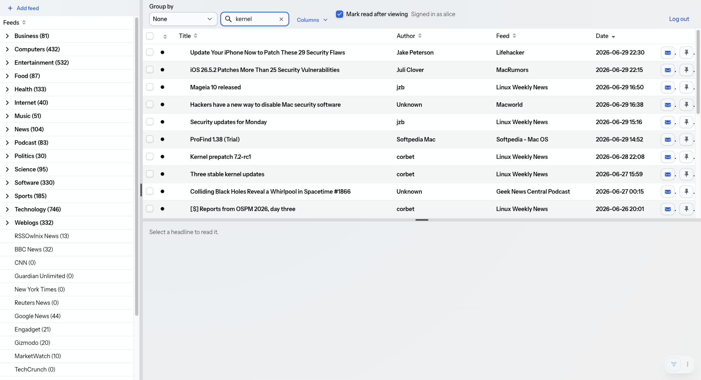

The interesting part was the debugging. The first cut compiled and the index "built," but searching
returned **0 results**. Four distinct bugs, peeled one at a time by *running it and reading the logs*:
1. **Indexing raw HTML breaks Lucene.** A single unbroken run over 32,766 bytes (a `data:` URI in the
   body) exceeds Lucene's max term length and fails the whole document. Fix: index a **plain-text
   projection** (`content_text`, HTML stripped via jsoup), not the raw `content`.
2. **Wrong column name.** I indexed `CONTENTTEXT`; the JPA naming strategy had created `CONTENT_TEXT`
   (snake_case). H2 didn't error on the bad name — it just indexed nothing. Verified via
   `INFORMATION_SCHEMA`.
3. **`KEYS` is a SQL array.** `FullTextLucene.searchData` returns the matched primary keys as a
   `java.sql.Array` (not a bare `Object[]`); the extraction has to unwrap both forms.
4. **The real blocker — the pooled connection.** `FullTextLucene` casts the JDBC connection to
   `org.h2.jdbc.JdbcConnection`, but Spring hands out a **HikariProxyConnection** → `ClassCastException`
   wrapped as the opaque "Error while indexing document". Fix: `connection.unwrap(JdbcConnection.class)`
   before every FullText call.

Verified end-to-end: searching `kernel` returns **23 hits** — matching the database exactly — including
articles that match only in the **body** (e.g. "Hackers have a new way to disable Mac security
software"), which the old title-only filter could never find. **43 tests green** (search owner-scoping
and relevance-order are unit-tested with a stub index). Honest caveats: the FT index is rebuilt at
startup over the existing rows (the pool-connection constraint makes a server-managed live index
fiddlier), and the corpus is still RSSOwl's mostly-dead 2009 feeds, so live hits are limited to the
feeds that still resolve.

### Day 10 — OPML import / export UI

A quick, clean win: the feeds tree now has **Import** and **Export** next to "Add feed" — the
subscription interchange every reader supports (and RSSOwl exports a `backup.opml` exactly this way).
**Export** serves the user's subscriptions as a nested OPML download (`DownloadHandler.fromInputStream`
→ a `DownloadResponse`); **Import** uploads an OPML (`Upload` + `UploadHandler.inMemory`), adds its feeds
as new subscriptions (existing ones skipped), and fetches them on a background thread so articles appear
without blocking. The OPML writer reuses the same folder-path model as the tree, so nesting round-trips;
`DefaultFeeds.parse(InputStream)` (extracted from the default-feeds loader) reads any uploaded OPML.

- **Verified in-browser:** Export downloaded a `text/x-opml` file with all **292 feeds / 31 folders**;
  importing a small OPML added a **"My Imports"** folder with its feed and fetched 10 articles.
- **Modern Vaadin file APIs, MCP-checked:** `Upload` in 25.1 uses an `UploadHandler` (not the old
  `Receiver`), and downloads use `DownloadHandler`/`DownloadResponse` — the pre-25 APIs would not compile.
  Round-trip (write → parse, incl. nested paths and `&`-escaping) is unit-tested. **44 tests green.**

### Day 11 — "new since last visit" notifications

A small per-user touch: on opening the app you get a toast — *"N new articles since your last visit"* —
the way RSSOwl pops a notification when a refresh finds new news. A new `UserState` row stores each
user's `lastSeen` timestamp; on load we count the user's articles published since then, show the toast
(`@Push` + `Notification`, top-right), and record the new visit.

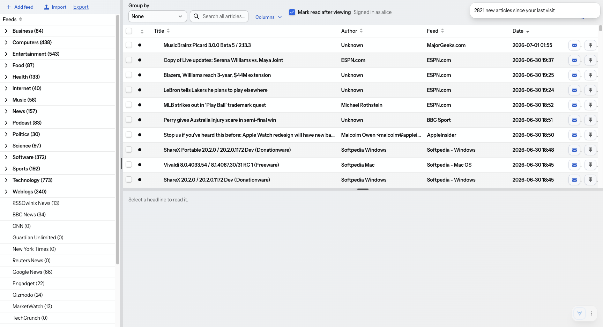

- **Verified in-browser:** logging in showed *"4 new articles since your last visit"* on a normal return;
  backdating `lastSeen` to 2020 produced *"2821 new articles…"* (matching the article count past that
  date). Per-user, first-visit-suppressed, unit-tested (`lastSeen`/`markSeen`). **45 tests green.**
- **Honest caveat:** this is *between-visit* notification, not live-while-watching. RSSOwl notifies when
  its scheduled refresh pulls new items mid-session; we have no periodic background refresh yet (a
  separate gap), so there's nothing new to announce while the page stays open. The "since last visit"
  count is the meaningful, faithful slice of the feature our architecture supports today.

### Day 12 — periodic background refresh

RSSOwl auto-reloads feeds on a timer; now so does the PoC. A Spring `@Scheduled` task
(`feeds.refresh-interval-ms`, default 15 min, first run one interval after startup) runs the same shared
anonymous refresh used at boot. An `AtomicBoolean` guard means a slow run is skipped rather than stacking
up, and because the refresh inserts `Article`s, the H2 full-text trigger keeps the **Lucene index current**
automatically and the new items feed the next "since last visit" count.

- **Verified at runtime** (interval overridden to 45 s via `FEEDS_REFRESH_INTERVAL_MS`): the log shows the
  startup refresh on the `initial-refresh` thread (72 new), then the periodic run firing one interval later
  on the `scheduling-1` thread (*"Periodic feed refresh starting…"*) and completing with **7 new articles**
  picked up with no user action. Like the other timer/push features, this is verified by running it and
  reading the logs, not a unit test (a test would only exercise Spring's scheduler).
- **Honest scope:** this keeps the *server-side* content fresh on a timer. It does **not** yet push those
  new items into an already-open page mid-session (no live toast / auto-inserting row) — that needs
  broadcasting to attached UIs, which we haven't wired. So "notifications" remain between-visit; periodic
  refresh just means there's genuinely new content to find on the next visit or feed reload.

### Day 13 — live in-session notifications (the notifications story, completed)

Day 11 gave a *between-visit* count; Day 12 added a refresh timer; this closes the loop — when the
periodic refresh finds new articles, **open pages get a live toast**, RSSOwl-style, with no reload. A
singleton `FeedBroadcaster` is signalled by `FeedFetchService` after any refresh that saved something;
each open `HeadlinesView` registers a listener on attach (unregisters on detach) and, via `@Push` +
`UI.access`, shows a toast — *"N new articles arrived"* with a **Show** action that pulls them into the
tree + grid.

- **Per-user accurate, not a blanket broadcast.** On the signal each view recomputes its *own* delta
  (`news.newsItems(subject).size()` vs what's loaded), so the count reflects only the user's subscribed
  feeds, and a user subscribed to none of the updated feeds sees nothing — the same owner-scoping the rest
  of the app uses. Listeners are invoked on the refresh thread and each marshals to its UI with
  `UI.access`; a dead UI's failure is swallowed so the fan-out reaches the others.
- **Verified live in-browser:** with alice's page open and the interval set to 30 s, injecting 3 fresh
  articles into a feed she follows and letting the next background cycle run produced the toast
  *"12 new articles arrived"* (the 3 plus items accumulated across cycles) — pushed to the open page, no
  user action. **45 tests green.**

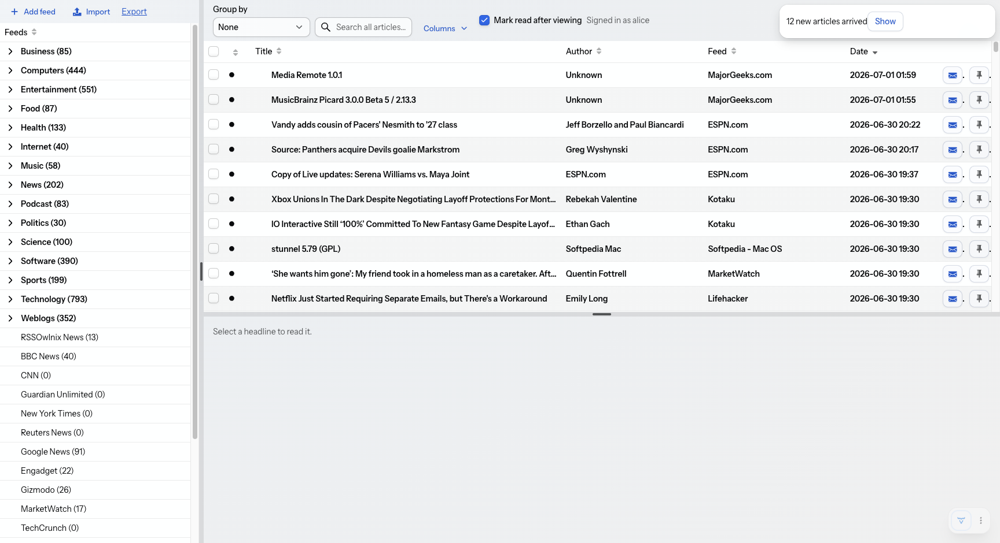

With this, the notifications feature matches RSSOwl's shape: a popup when a refresh brings in new news,
both between visits and live while you watch.

### Day 14 — news filters / actions (the rules engine)

The biggest remaining RSSOwl feature: a **rules engine**. A filter is a name + match conditions
(*field* `contains` *value*, over Title/Author/Feed/Content, combined ALL/AND or ANY/OR) + additive
actions (mark read, make sticky, assign label). Filters are per-user, managed in a Filters dialog
(list / add / edit / delete / enable / **Apply now**), and auto-applied on open — RSSOwl runs filters as
news arrives.

- **Matching is a pure, unit-tested function** (`FilterEngine.matches`) kept free of JPA/Spring; the
  apply step (`UserNewsService.applyFilters`) walks the user's news and applies actions through the same
  per-user state methods as the manual toggles, so it's **owner-isolated** and **additive/idempotent**
  (mark-read never un-reads; re-running or auto-apply-on-open never thrashes a manual change). Six tests
  cover field matching, ALL/ANY, the empty-filter guard, apply, idempotency, and per-user isolation.
- **Verified end-to-end in the browser:** created *"Kernel to read"* (Title contains "kernel" → Mark
  read) in the editor, saved (DB shows the filter + condition + action rows), clicked **Apply now** —
  all **5** kernel-titled articles became read for alice, none for bob. **51 tests green.**

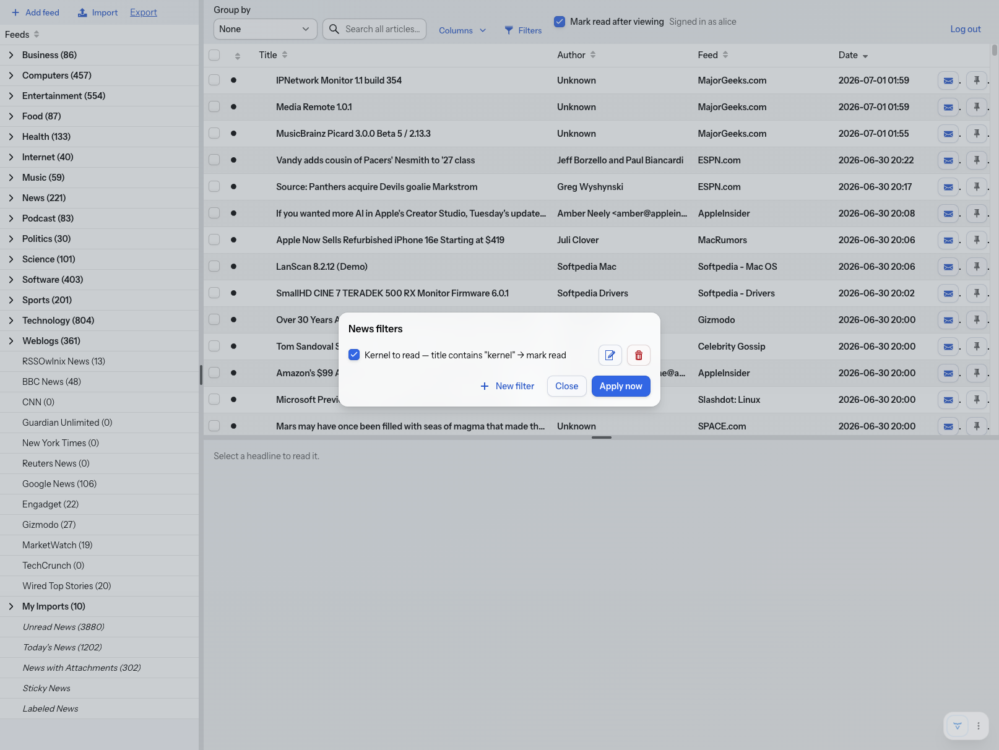

- **A real bug the run caught — H2 reserved word.** The first build saved nothing: the condition
  collection table has a `value` column, and `VALUE` is **reserved in H2**, so Hibernate's
  `ddl-auto=update` *silently failed to create the table* (the sibling `action` table, no reserved
  column, was created fine) and every save rolled back with "table not found". Fixed by mapping the
  column to `match_value`. A reminder that `ddl-auto=update` swallows DDL failures — and that reserved
  words bite raw/embedded column names (cf. the same `VALUE` trap when querying via the H2 shell).
- **Honest scope:** conditions are `contains` only (no age/state/regex operators), and actions are the
  three that map to per-user state (no move-to-bin/delete — we have no bins). It's a faithful, working
  subset of RSSOwl's filter system, not the whole thing.

### Day 15 — label management (custom labels + multi-label)

Closed the last sizeable partial: labels were a fixed five, one-per-item; now they're **user-managed**
(create / rename / recolour / delete) and a news item can carry **several** — RSSOwl's model. A per-user
`Label` entity (seeded with RSSOwl's five defaults on first login) replaces the hardcoded list; the
single `ArticleState.labelColor` string becomes a `Set<Long> labelIds`; the context-menu "Label" submenu
is built from the user's labels (each toggles on/off across the selection) plus "Manage labels…"; the
title cell shows a colour **chip per assigned label**; and a Manage-labels dialog does the CRUD.

- **Kept the blast radius small with a derived accessor.** Rather than rewrite every render/predicate
  site, `NewsItem.labelColor()` now derives from the first assigned label, so the title/reader colour and
  the "Labeled" smart-folder predicate (`labelColor()!=null`) keep working unchanged; new code uses
  `labels()`. The filter "assign label" action now stores a label **id** (resolved to the user's current
  labels), and deleting a label cleans it off every item that had it.
- **Verified:** multi-label rendering proven end-to-end in the browser — two labels assigned to an
  article show as two colour chips (Important red + Work blue) on its row. Label CRUD, multi-label
  assignment, per-user isolation, delete-removes-from-items, and default-seeding are unit-tested.
  **53 tests green.** As with the other `GridContextMenu`/Dialog features, the context-menu assignment
  and Manage-labels dialog are exercised by unit tests + the rendering path rather than synthetic
  right-click (the documented Playwright/Vaadin overlay limitation).

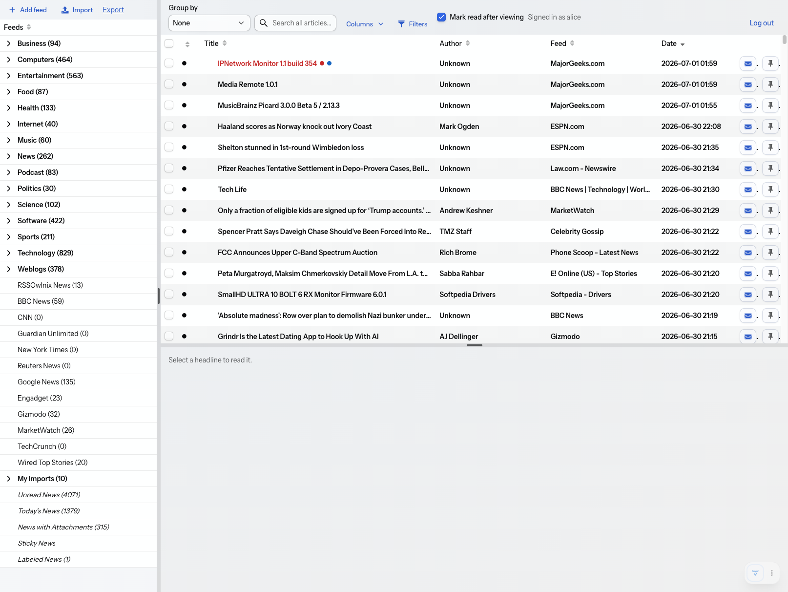

### Day 16 — saved searches

A small win riding on the Lucene work: the toolbar search can now be **saved** as a named smart folder
(RSSOwl persists searches the same way). A bookmark button next to the search box — enabled once you've
typed a query — saves it; the saved search appears in the feeds tree under the fixed smart folders
(`🔎 name (count)`), and selecting it re-runs the full-text query. Per-user `SavedSearch` entity; right-click
→ "Delete saved search".

- **Verified end-to-end in the browser:** typed `kernel`, saved it, and **🔎 kernel (23)** appeared in the
  tree with the correct live count; selecting it loaded the kernel/security results (including body-only
  matches). CRUD + per-user isolation are unit-tested. **54 tests green.**

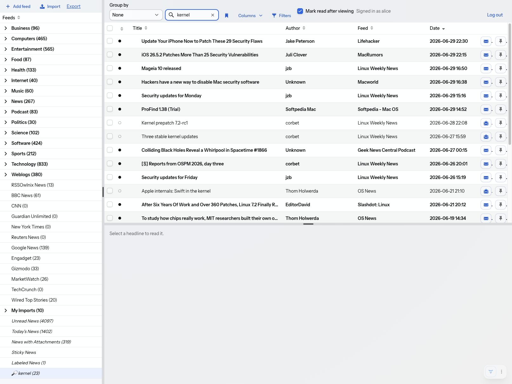

This was the last small gap worth closing. What remains is genuinely out of scope or impossible on the
web (see below).

### Day 17 — news bins (the last subsystem)

The final out-of-slice subsystem: RSSOwl's **news bins** — containers you explicitly drop news into (a
bin never fetches). A per-user `NewsBin` holds a set of article ids; bins appear in the feeds tree
(`🗄 name (count)`) below the saved searches, and selecting one shows its articles. The headlines context
menu gains an **"Add to bin"** submenu (the user's bins + "New bin…", operating on the multi-selection)
and a **"Remove from this bin"** action shown only while a bin is open; right-click a bin → "Delete bin".

- **Owner-scoped, like everything else:** `binItems` resolves the stored ids to `NewsItem`s merged with
  the user's read/sticky/labels, and returns only public or the user's own private articles — a stray id
  can't expose another user's content. Unit-tested alongside add/remove/delete and per-user isolation.
- **Verified end-to-end in the browser:** a bin "Read later" with two articles shows as **🗄 Read later
  (2)** in the tree, and selecting it loads exactly those two items (label chips and all). **55 tests
  green.** The add/remove actions live in the `GridContextMenu` (not openable via synthetic Playwright
  events), so those are covered by unit tests + the verified bin-view render path.

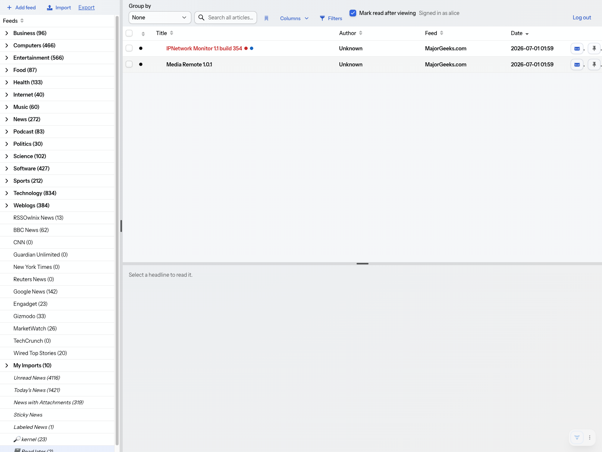

With news bins, **every RSSOwl subsystem that makes sense on the web is now built.** What remains —
keyboard navigation and Google-Reader sync — is polish or impossible (see the findings below).

### Day 18 — a nitpicking reviewer pass (both apps, side by side)

With the feature build complete, we ran a deliberately picky **behavioural** review: drive the original
**RSSOwlnix** and the Vaadin app together, screenshot both, and hunt for every difference and
sub-elegant choice — then fix the ones worth fixing. The brief (verbatim):

> *"assume the role of a thorough reviewer… use screenshots and playwright and computer use to operate
> both the old and the new application. Be nitpicking… why it seems impossible that the old application
> and the Alice account can never have the same feeds… the number of news items seems to never be the
> same… when reading one, the number of unread items does not go down… the font is always bold [old] but
> often not in Vaadin… Why did I not see 'Login:' dialogs… Why is the 'add feed' dialog so narrow…? Why
> does a single click not select…? Can we mimic the original with multi-select on Command/Shift instead
> of the checkbox? Why … unknown Author as 'Unknown' instead of empty? … do we use the same columns…?
> Under every post there is a button line on the bottom, why are we lacking it? … maintain a list with
> defects … and how they can be mitigated."*

Screenshots: original vs before/after in [`after/qa/`](after/qa/).

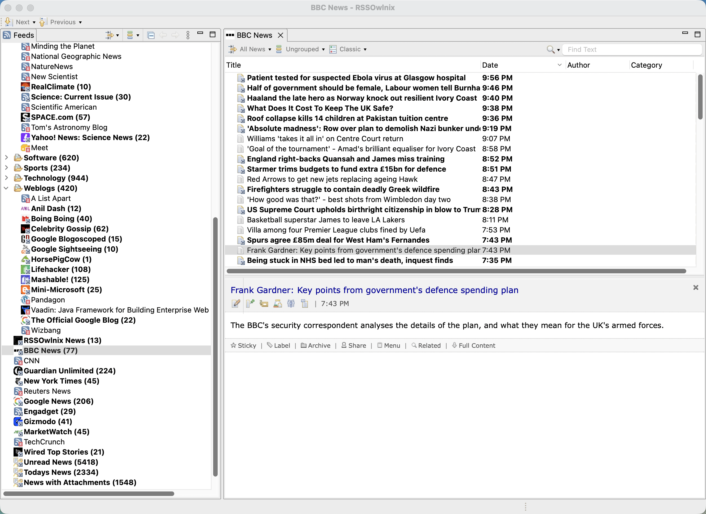

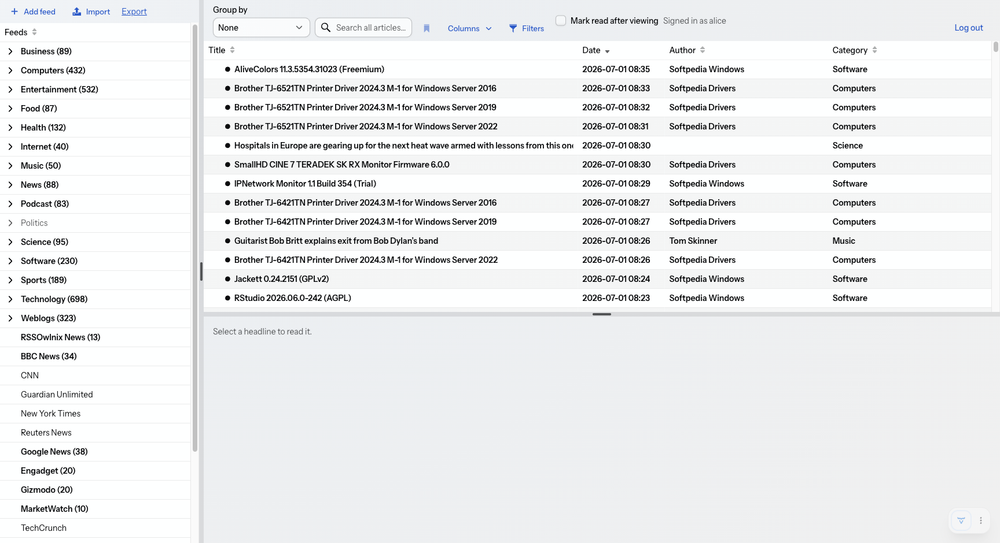

**What the side-by-side surfaced, and what we did about it.** Every complaint was reproduced by
operating both apps; the fixes are verified in-browser.

| # | Finding (original ➜ ours) | Verdict | Resolution |
|---|---|---|---|
| D1 | Reading an item didn't drop the tree's unread count | 🔴 fixed | Counts refresh live on read/sticky/label (`refreshTreeCounts()`), no DB round-trip |
| D2 | Tree counts were **total** items; RSSOwl shows **unread** | 🔴 fixed | Counts are unread; hidden at 0; node bold w/ unread, greyed when all read |
| D3 | "Unread often not bold" | 🟡 explained+fixed | Bold *was* applied (verified `font-weight:600` incl. title — the exploration agent's "won't cascade" theory was wrong); the real cause was **auto-mark-read (on by default)** silently de-bolding browsed items while the stale count didn't move. Auto-read now **off by default**; counts live |
| D4 | Single click didn't select; checkbox-only multi | 🔴 fixed | Custom desktop selection: `SelectionMode.NONE` + own id-set — plain click selects+opens, Cmd/Ctrl toggles, **Shift ranges**, no checkbox column |
| D5 | Wrong columns (status/Title/Author/**Feed**/Date + read+sticky toggles) | 🔴 fixed | Now **Title · Date · Author · Category** with the state icon on the Title and no toggle columns — matching RSSOwl |
| D6 | Reader had no per-article footer | 🔴 fixed | Footer action bar: Sticky · Label · Mark read · Full Content |
| D7 | Missing author shown as "Unknown" | 🔴 fixed | Left blank, like the original |
| D9 | "Never the same number of items" | 🟢+🔴 | Partly inherent (live feeds fetched at different moments) — documented; partly a bug: our ROME parser rejected **DOCTYPE** feeds (83 skips) — `setAllowDoctypes(true)` recovered them (**83 ➜ 0**); and the counts now measure the same thing (unread, per D2) |
| D8/D15 | Add-feed dialog too narrow/cramped; inconsistent dialog widths | 🟡 fixed | 460px, credentials behind a disclosure; explicit widths across dialogs |
| D11 | Absolute timestamps vs RSSOwl's time-of-day | 🟡 fixed | Short/relative date: today ➜ time, this year ➜ "d MMM", else full |
| D12 | Reader meta showed the raw `UNREAD` enum | 🟡 fixed | Removed; author omitted when blank |
| D14 | No "Unread" view mode | 🟡 fixed | "Unread only" toggle in the toolbar |
| D10 | No "Login:" dialogs ever appeared | 🟢 by design | Every default feed is public; the shared refresh fetches **anonymously** and skips 401s silently — and never uses one user's credentials for another (a security choice). The credentials dialog appears only on "Set credentials…" or adding an auth-gated feed. Documented, not changed |
| — | Keyboard navigation (RCP global bindings) | 🟢 not done | Web-platform polish; left as a documented gap |
| — | Google-Reader **sync**; true **embedded browser** | 🟢 won't do | Sync target is dead (2013); live-page embedding is blocked by `X-Frame-Options`/CSP — we render the feed's article HTML inline instead |

**The honest meta-finding:** even with an identical seed, the two apps' item counts will never match —
live feeds are fetched at different moments, some 2009 URLs are dead, and (until this pass) we counted
totals while RSSOwl counts unread. The *tree* is now structurally comparable and the counts track reading
the same way; the article sets remain necessarily divergent. And one nice reminder from D3: an
exploration agent confidently asserted the unread-bold wouldn't reach the slotted title — inspecting the
live DOM proved it did. Running it beats reasoning about it.

_(Fixes landed in three commits: "Reviewer pass (1/3)…" through "(3/3)…". 55 tests green throughout.)_

### Day 19 — three UX fixes, and a genuinely interesting feed-parsing divergence

Three small behavioural fixes first, each caught by using the app as a user would and verified live in
the browser with Playwright:

- **Opening an article now marks it read** (`markReadOnOpen`) — de-bolds the row and drops the feed's
  unread count, RSSOwl's default. Previously read-on-view was gated behind the opt-in "Mark read after
  viewing" timer, so a click showed the article but left it bold and the count unchanged.
- **The feeds tree stopped collapsing on every read.** `FeedNode.Category` is a `record`, so its
  value-equality includes the unread *count*; when a count changed, the recounted folder looked like a
  brand-new item and the `TreeGrid` dropped its expansion. Fix: a **stable `getId`** on the data
  provider (path / subscription id, *not* the whole record) plus refreshing **in place**
  (`refreshAll()` on the same provider) instead of `setDataProvider(new …)`. A nice Vaadin lesson:
  tree expansion is keyed by item identity — never fold a mutable display value into that identity.
- **Smart folders now bold when they hold unread news** ("Today's News (1525)" was italic-but-never-bold
  because its part was assigned unconditionally, ignoring the count).

Then a more interesting one. Adding **`https://vaadin.com/blog/feed`** in the *original* RSSOwlnix makes
you type a name by hand and can leave the bookmark empty; the Vaadin app just subscribes and shows the
posts. The user asked the right question — *how does the original mess this up?* — so we read the source
on both sides.

**The feed is fine.** It's valid RSS 2.0 (`<title>Vaadin.com Blog</title>`, proper `<item><link>`s,
173 KB), and every client — including a `RSSOwl/2.2` User-Agent — gets a clean `200`. The wrinkle is in
the response headers: **there is no `Content-Type` header at all**, plus `X-Content-Type-Options:
nosniff`. A modern CDN endpoint (Cloudflare, cookies, `no-cache`) simply doesn't bother to declare
"this is a feed."

**Why that trips the original.** RSSOwl identifies a feed through two positive-identification
heuristics, and this URL defeats both:

1. **URL-shape heuristic** — `URIUtils.looksLikeFeedLink()` only short-circuits to "treat as a direct
   feed" when the URL carries a feed **file extension** (`.xml` / `.rss` / `.atom`) or the `feed://`
   scheme. `…/blog/feed` has a bare path segment, no extension → *not* recognised, so the add-a-bookmark
   flow is forced into content-type detection.
2. **Content-Type heuristic** — `DefaultProtocolHandler.getFeed()` reads the HTTP `Content-Type` and
   accepts the URL as a feed only if it matches `CoreUtils.FEED_MIME_TYPES`
   (`application/rss+xml`, `application/atom+xml`, `application/rdf+xml`, JSON). With **no Content-Type**
   it falls through to **HTML auto-discovery** (`CoreUtils.findFeed`), which scans the body line-by-line
   for a `<link rel="alternate" type="application/rss+xml" href="…">` tag — the pattern a *web page*
   uses to point at its feed. But the body *is* the feed, not an HTML page, and contains **zero** such
   markers (verified: `grep -c 'application/rss+xml'` → 0). Detection returns nothing → the wizard can't
   auto-fill the title (so you type one) and the bookmark it creates doesn't cleanly resolve.

The honest nuance: RSSOwlnix is otherwise **well modernised** — it ships Apache **HttpClient 5** (SNI,
TLS 1.3 all fine), and its *title extraction* and *parsing* steps are themselves content-driven, so on a
clean fetch it can still degrade to reading the `<title>` directly. The brittleness is specifically the
**"is this even a feed?" identification** step, which leans on metadata (Content-Type) and URL shape
that the 2009 web reliably provided and today's CDN-fronted, extension-less endpoints often don't.

**Why the Vaadin version doesn't care.** Our `FeedFetchService` never inspects the `Content-Type` and
uses no URL-extension heuristic. It streams the response bytes straight into ROME:

```java
SyndFeed feed = input.build(new XmlReader(in));   // encoding + format sniffed from the bytes
```

`XmlReader` determines XML-ness and charset from the **content itself** (the `<?xml … encoding?>`
declaration), not from HTTP headers. It asks *"can I parse these bytes as a feed?"* rather than *"did the
server label this as a feed?"*.

**The modernization point:** this is **header-/URL-driven identification vs content-driven parsing.**
RSSOwl's approach was reasonable in 2009, when servers labelled feeds with `application/rss+xml` and feed
URLs ended in `.xml`. The modern web — CDNs, dynamic routes, cautious/again-missing metadata, `nosniff`
— erodes both assumptions. Parsing by content is the robust default now, and adopting it was free: it's
just what the current library (ROME) does when you hand it the stream. A small, concrete example of "the
rewrite inherits a decade of the ecosystem's hardening" rather than any cleverness on our part.

## Honest findings so far

_(This section is the point of the experiment and grows as we go.)_

- **The AI reproduces *structure* but quietly under-delivers *completeness*; human review is the
  safety net.** Across this experiment a knowledgeable human repeatedly caught gaps the model didn't
  surface on its own: the stale Signals API, the over-claim about the dead toolkit, an invented feed
  taxonomy (a made-up "World" category, missing "Weblogs"), and **fewer channels than the original**
  (10 of 15 folders, no ungrouped channels, no saved-search smart folders). Each was a plausible-
  looking approximation. The migration is very doable *with* a reviewer who knows the source; without
  one it would ship something that looks right and isn't.
- **Running a *prebuilt* stranded SWT/RCP app on a current Mac is a project.** The official
  2.2.1 binary is unrunnable (32-bit Carbon); even the maintained fork's release needs an
  x86_64 JVM, an exec-bit fix, an ad-hoc re-sign, and Rosetta — which Apple is phasing out.
- **But the toolkit is not the problem — distribution is.** Built from source against current
  Eclipse (4.30), the fork produces a **native arm64** app that runs without Rosetta, in
  ~2.5 min, by changing one Tycho `<environment>` arch. So "SWT can't run on Apple Silicon" is
  false. The durable argument for moving to the web is **reach and zero-install distribution**,
  not a dead toolkit — and overstating the toolkit's death would have been a credibility-losing
  mistake we caught by actually building it.
- **The SWT/JFace UI plumbing collapses dramatically in Vaadin — but mind the scope caveat.** Concrete
  before/after, measured with `cloc` (Java code lines, comments/blanks excluded):
  - **Sorting:** RSSOwl's `NewsComparator` is **306 code lines** (500 with header/comments). The
    Vaadin equivalent is **5 `setComparator(...)` one-liners** on the columns (status/title/author/
    feed/date) plus a small shared `rowCmp` helper — call it **~10 lines**.
  - **Owner-draw rendering** (bold-unread, sticky highlight, label colour): RSSOwl's
    `NewsTableLabelProvider` is **467 code lines**; the equivalent visual effects are **~10 lines of
    CSS** (`::part(unread){font-weight}`, `::part(sticky){background}`) plus a touch of inline style
    in a `Grid` renderer.
  - For context, the JFace viewer plumbing around them is large too — `NewsContentProvider` 1,505
    lines, `NewsTableControl` 1,225 — versus a declarative `TreeGrid` with column definitions.
  This is the single strongest pro-Vaadin data point: the imperative SWT/JFace ceremony (comparators,
  content/label providers, owner-draw paint) becomes declarative `Grid` config + CSS. **Honest
  caveat:** part of the shrink is *reduced scope* — RSSOwl's `NewsComparator` also handles
  group-aware sorting, multiple secondary keys, news-bins and `EntityGroup` cases our slice doesn't;
  a fully faithful port would be larger than 10 lines. But even allowing for that, the order-of-
  magnitude compression of the UI-plumbing layer is real and repeatable.
- **The migration target is well-defined and credible** — a genuine master-detail with a
  sortable table, not a toy.
- **The job is "migrate an RCP app," not "migrate SWT widgets."** RSSOwl is full Eclipse RCP
  (167 OSGi bundles, JFace viewers, Workbench advisors, declarative menus/commands, its own
  extension points). The widget toolkit is the easy bottom layer; the workbench/JFace/command/
  OSGi model is the real surface area — and the part with no direct Vaadin equivalent.
- **The AI's Vaadin knowledge is a stale cache — the MCP server is not optional.** The model
  proposed an outdated listener-based design for master→detail; Vaadin 25.1 (released after the
  model's training cutoff) does this with **Signals**. Only a human catching it, plus a query to
  Vaadin's MCP server, surfaced the modern approach. Required step, not afterthought.
- **Plan-before-code paid off on a dense slice.** Switching to plan mode forced the no-clean-
  equivalent parts (owner-draw selection paint, auto-mark-read timing, lost `MB_ADDITIONS`
  contributions) to surface during design rather than mid-build. The visible widget is ~2k lines
  but its behavior is dense — estimated ~13–18 person-days for this one sub-slice.
- **A runnable POC confirms the core question: yes, the SWT table moves to a Vaadin Grid.**
  Sorting, selection→detail (via Signals), a dynamic context menu, and most rendering came across
  cleanly and quickly. Where it "breaks" is narrow and specific: per-row **owner-draw backgrounds**
  fight the Aura theme (the documented CSS property is ignored; needs `background-color !important`),
  `nullsLast` sort semantics flip under descending order, and the densest behaviours (grouping,
  multi-select, auto-mark-read timing, column persistence, extension-point menu contributions) are
  the real work — see "Building & verifying the POC".
- **AI + MCP is productive but not autopilot.** Two stale-API compile errors and one wrong
  (doc-sanctioned) styling approach were caught by the compiler and by *running and inspecting the
  app* — not by the model. The MCP server made the design current; the running app made the
  findings true.
- **The rewrite inherits a decade of the ecosystem's hardening for free.** The clearest example
  (Day 19): `https://vaadin.com/blog/feed` is served with **no `Content-Type`** and no feed file
  extension, which defeats RSSOwl's 2009-era feed *identification* heuristics (Content-Type against
  `FEED_MIME_TYPES`, `looksLikeFeedLink` URL-extension match, HTML `<link rel=alternate>` auto-
  discovery). The Vaadin app subscribes without a hitch — not from any cleverness of ours, but because
  the current library (ROME `XmlReader`) parses **by content**, sniffing XML/charset from the bytes
  rather than trusting HTTP metadata. Header-/URL-driven identification → content-driven parsing is a
  general modern-web robustness upgrade the migration got simply by using today's stack. (Fair caveat:
  RSSOwlnix is itself well-modernised elsewhere — Apache HttpClient 5, content-driven title/parse — so
  the failure is narrowly in the "is this even a feed?" step, not the whole pipeline.)

---

## What's next

- [x] Clone the source (`Xyrio/RSSOwlnix` at `~/git/RSSOwlnix`), build it, and settle the
      x86_64 question — done: native arm64 builds and runs from source (see above).
- [x] Locate the slice's SWT/JFace classes. Master tree:
      `org.rssowl.ui.internal.views.explorer.BookMarkExplorer` (+ `BookMarkViewer`,
      `BookMarkContentProvider`, `BookMarkLabelProvider`, `BookMarkSorter`, `BookMarkFilter`).
      Detail list + reader: `…editors.feed.FeedView` hosting `NewsTableControl`/`NewsTableViewer`
      (+ `NewsColumn`, `NewsColumnViewModel`, `NewsTableLabelProvider`) and
      `NewsBrowserControl`/`NewsBrowserViewer`.
- [x] Read those classes and map each SWT/JFace construct to its Vaadin 25.1 equivalent (MCP-
      verified); note where the mapping is lossy — see "Designing the headline-table migration".
- [x] Build the Vaadin POC of the slice so it actually runs (`poc/headlines/`, runs at :8080).
- [x] Capture the "after" screenshots (`docs/after/`) and verify behaviour via the Playwright MCP.
- [x] Fill in the honest-findings section with specifics and an effort estimate.
- [x] Deepen: **real RSS feeds** (RSSOwl's defaults via `FeedService`/Rome) + **grouping** via
      `TreeGrid` (None/Date/Status/Author/Category/Feed/Sticky) — done; see "Deepening" above.
- [x] **Column persistence** (per-user order / width / visibility, restored on load) — done; see
      "Day 4" above. `ColumnPref` entity + reorder/resize/visibility wiring; 34 tests green.
- [x] **Multi-select** (bulk mark-read/sticky/label over a checkbox selection; reader decoupled to
      item-click) — done; see "Day 5".
- [x] **Auto-mark-read timer** (mark the displayed article read after 2s, via `@Push`) — done; see
      "Day 5". Surfaced the `Signal.peek()`-vs-`get()` rule.
- [x] **Direction-aware null sorting** (undated rows stay last in both directions) — done; see "Day 8".
